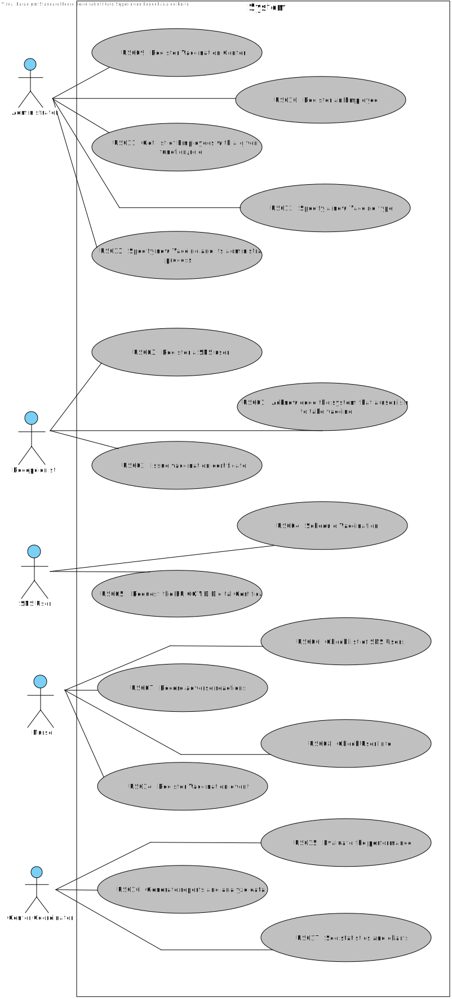

# Use Case Diagram (UCD)

# Use Cases / User Stories
| UC/US                | Description                                                                                    |                   
|:---------------------|:-----------------------------------------------------------------------------------------------|
| [US03](US03/US03.md) | As a Receptionist, I want to register a SNS User.                               |
| [US09](US09/US09.md) | As an Administrator, I want to register a vaccination center to respond to a certain pandemic. |
| [US10](US10/US10.md) | As an Administrator, I want to register an Employee.                                           |
| [US11](US11/US11.md) | As an Administrator, I want to get a list of Employees with a given function/role.             |
| [US12](US12/US12.md) | As an Administrator, I intend to specify a new vaccine type.                                   |
| [US13](US13/US13.md) | As an Administrator, I intend to specify a new vaccine and its administration process.         |

