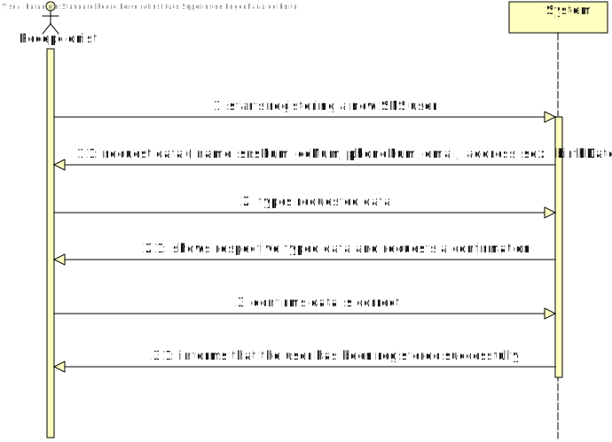
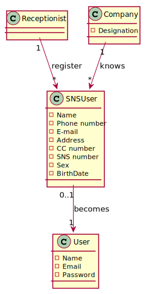
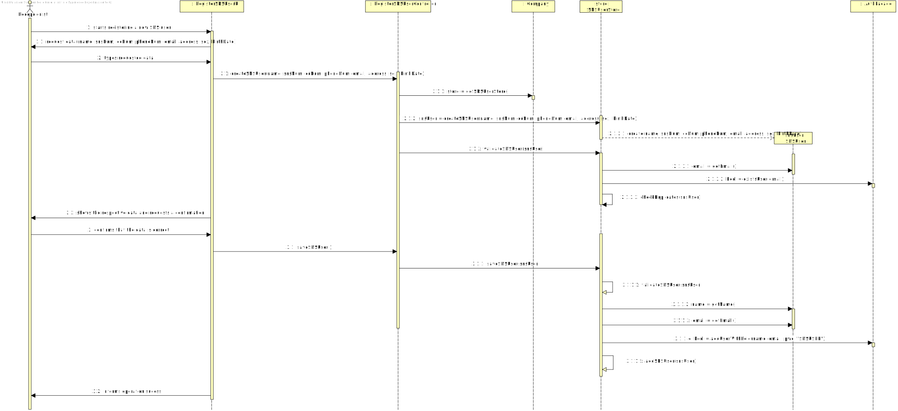
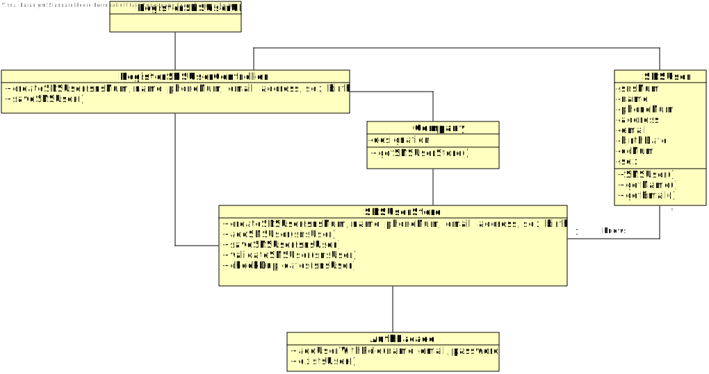

# US 003 - To register a new SNS user

## 1. Requirements Engineering

### 1.1. User Story Description

- *As a receptionist, I want to register an SNS user.*

### 1.2. Customer Specifications and Clarifications 
#### From the specifications document:
- "When the SNS user arrives at the vaccination center, a receptionist registers the arrival of the user to
  take the respective vaccine."

- "The receptionist asks the SNS user for his/her SNS user number and
  confirms that he/she has the vaccine scheduled for the that day and time."

- "If the information is
  correct, the receptionist acknowledges the system that the user is ready to take the vaccine."

#### From the client clarifications :

>- **Question:** What are the data that characterize an SNS user?
>- **Answer:** The attributes that should be used to describe an SNS user are: Name, Address, Sex, Phone Number, E-mail, Birth Date, SNS User Number and Citizen Card Number.
>- **Answer:** The E-mail, Phone Number, Citizen Card Number and SNS User Number should be unique for each SNS user.

>- **Question:** What is the correct format for the employee's phone number and cc? Should we consider that these follow the portuguese format?
>- **Answer:** Consider that these two attributes follow the portuguese format.

### 1.3. Acceptance Criteria

- **AC1:** The SNS user must become a system user.
- **AC2:** The "auth" component available on the repository must be reused(without modifications).
- **AC3:** The following fields must be unique for each SNS user: citizen card number, SNS number, phone number and e-mail.
- **AC4:** All input fields are required except sex.
- **AC5:** The password should be randomly generated.
- **AC6:** The phone and SNS number must be 9 digits and the cc number 8 digits(portuguese format)

### 1.4. Found out Dependencies

- *There is a dependency to "US010 : register an employee" since a receptionist is an employee and must exist in order to register a SNS user.*

### 1.5 Input and Output Data

#### Input Data

- **Typed Data:**
  - Name
  - Email
  - Address
  - SNS user number
  - Phone number
  - Birth Date
  - Citizen Card number

- **Selected Data:**
  - Sex

#### Output Data
- Informs about the success or failure of the operation.

### 1.6. System Sequence Diagram (SSD)

### 1.7 Other Relevant Remarks

n/a

## 2. OO Analysis

### 2.1. Relevant Domain Model Excerpt

### 2.2. Other Remarks

n/a

## 3. Design - User Story Realization 

### 3.1. Rationale

**The rationale grounds on the SSD interactions and the identified input/output data.**

| Interaction ID | Question: Which class is responsible for... | Answer       | Justification (with patterns)  |
|:-------------  |:--------------------------------------------|:-------------|:---------------------------- |
| Step 1  		 | ...interacting with the receptionist?					           |RegisterSNSUserUI  | **Pure Fabrication:**  there is no reason to assign this responsibility to any existing class in the Domain Model |
|  		 | ...coordinating the US003?	|RegisterSNSUserController              | **Controller**                             |
| Step 2  		 | ...saving the typed data							 |SNSUser          |**IE:** a SNS user knows its own data                              |
| 		 | ... instantiating a new SNSUser?							       |SNSUserStore              |**HC+LC:** by applying this method we are moving the responsibilities that were on "Company" to the "SNSUserStore"                              |
|   		 | ... knowing SNSUserStore? 		 |Company              |**IE:** Company knows the SNSUserStore to which it is delegating some tasks                              |
| Step 3 		 | ... validating all data (local validation)?						       |SNSUser              |**IE:** an object knows its data                              |              
|  		 | ... validating all data (global validation)?							   |SNSUserStore              |**IE:** knows all SNS users                              |
|   		 | ... validate the exclusivity of the SNS user's email?			     |AuthFacade                |**IE:** user management is responsibility of the respective external component                              |
|   		 | ... registering the SNS user as a system user?							  |AuthFacade              |**IE:** user management is responsibility of the respective external component                              |
|   		 | ... saving the SNS user?							                                     |SNSUserStore              |**IE:** knows all SNS users                              |  
| Step 4        | ... informing operation (in)success? |RegisterSNSUserUI|**IE:** is responsible for user interactions|

### Systematization ##

According to the taken rationale, the conceptual classes promoted to software classes are: 

 * Company
 * SNSUser

Other software classes (i.e. Pure Fabrication) identified: 
 * RegisterSNSUserUI  
 * RegisterSNSUserController
 * SNSUserStore

## 3.2. Sequence Diagram (SD)

## 3.3. Class Diagram (CD)

# 4. Tests 

**_DO NOT COPY ALL DEVELOPED TESTS HERE_**

**Test 1:** Check that is possible to create an instance of the SNSUser with valid values.

    @Test
        public void createValidSNSUser() {
        SNSUser test = new SNSUser("Pedro", 344356756, 23224566, 915367656, "1210825@isep.ipp.pt", "Rua Lavadouro de Forta nº27", "Male", "03/05/2001");
        Assert.assertNotNull(test);
    }

**Test 2:** Check that it is not possible to create an instance of the SNSUser class with null values.

	@Test(expected = IllegalArgumentException.class)
		public void ensureNullIsNotAllowed() {
		SNSUser test = new SNSUser(null, null, null, null, null, null, null, null);
	}

**Test 3:** Check that is not possible to create an instance of the SNSUser class with five digits SNS number(snsNum).

    @Test(expected = IllegalArgumentException.class)
        public void createSNSUser5DigitsSNSnumber() {
        SNSUser test = new SNSUser("Pedro", 34435, 23224566, 915367656, "1210825@isep.ipp.pt", "Rua Lavadouro de Forta nº27", "03/05/2001");
    }

**Test 4:** Check that is not possible to create an instance of the SNSUser class with negative numbers.

    @Test(expected = IllegalArgumentException.class)
        public void createSNSUserNegativeNumbers() {
        SNSUser test = new SNSUser("Pedro", -344356756, -23224566, 915367656, "1210825@isep.ipp.pt", "Rua Lavadouro de Forta nº27", "03/05/2001");
    }

**Test 5:** Check that is possible to create an instance of the SNSUser class with null value on "sex" attribute

    @Test
        public void createValidSNSUserWithNullSex() {
        SNSUser test = new SNSUser("Pedro", 344356756, 23224566, 915367656, "1210825@isep.ipp.pt", "Rua Lavadouro de Forta nº27", null, "03/05/2001");
        Assert.assertNotNull(test);
    }

# 5. Construction (Implementation)
n/a

# 6. Integration and Demo 
n/a

# 7. Observations
n/a

