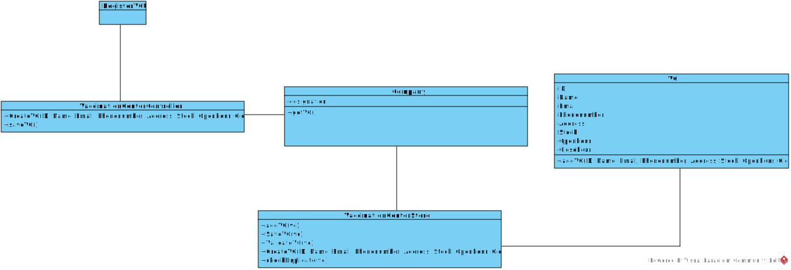

# US 09 - XXXX XXXX

## 1. Requirements Engineering

*In this section, it is suggested to capture the requirement description and specifications as provided by the client as well as any further clarification on it. It is also suggested to capture the requirements acceptance criteria and existing dependencies to other requirements. At last, identify the involved input and output data and depicted an Actor-System interaction in order to fulfill the requirement.*

### 1.1. User Story Description

- *As an administrator, I want to register a vaccination center to respond to a certain pandemic*

### 1.2. Customer Specifications and Clarifications 

- *New Vaccination Center in Lisbon, An administrator register this vaccination center in the system.*

- *Pandemic Covid-19, administrator select vaccinations center that have vaccine that combat Covid-19.*

- *If the information is correct, the administrator can show the list of vaccinations center that can combat the Covid-19*

### 1.3. Acceptance Criteria

n/a

### 1.4. Found out Dependencies

n/a

### 1.5 Input and Output Data

###Input Data

- *Typed data*
  - ID
  - Name
  - Email
  - Phonenumber
  - Address
  - Stock
  - Openhour
  - Closehour

###Output Data
- *Confirms that the vaccination center was registered or not in system.*

### 1.6. System Sequence Diagram (SSD)

### 1.7 Other Relevant Remarks

n/a 

## 2. OO Analysis

### 2.1. Relevant Domain Model Excerpt 
*In this section, it is suggested to present an excerpt of the domain model that is seen as relevant to fulfill this requirement.* 

### 2.2. Other Remarks

n/a

## 3. Design - User Story Realization 

### 3.1. Rationale

**The rationale grounds on the SSD interactions and the identified input/output data.**

| Interaction ID | Question: Which class is responsible for... | Answer       | Justification (with patterns)                 |
|:-------------  |:--------------------------------------------|:-------------|:----------------------------------------------|
| Step 1  		 | 	...registering a vaccination center?						 | Company      |                                               |
| Step 2  		 | 	n/a						                                  |              |                                               |
| Step 3  		 | 	...saving the input data?						            | Class VC     | (the object created in step1 has its own data) |
| Step 4  		 | 	...Validate da data?						                 | Company      | (knows all VC objects)                        |
| Step 5  		 | 	...Saving the created VC?						            | Company      | (adopts/records all the VC objects)           |
| Step 6  		 | 	...informing operation sucess?						       | RegisterVCUI | (responsible for user interation)             |              
| Step 7  		 | 							                                     |              |                                               |
| Step 8  		 | 							                                     |              |                                               |
| Step 9  		 | 							                                     |              |                                               |
| Step 10  		 | 							                                     |              |                                               |  

### Systematization ##

According to the taken rationale, the conceptual classes promoted to software classes are: 

 * Class VC
 * Class Company

Other software classes (i.e. Pure Fabrication) identified: 
 * VaccinationCenterUI  
 * VaccinationCenterController
 * VaccinationCenterStore

## 3.2. Sequence Diagram (SD)

*In this section, it is suggested to present an UML dynamic view stating the sequence of domain related software objects' interactions that allows to fulfill the requirement.* 

## 3.3. Class Diagram (CD)

*In this section, it is suggested to present an UML static view representing the main domain related software classes that are involved in fulfilling the requirement as well as and their relations, attributes and methods.*

# 4. Tests 
*In this section, it is suggested to systematize how the tests were designed to allow a correct measurement of requirements fulfilling.* 

**_DO NOT COPY ALL DEVELOPED TESTS HERE_**

**Test 1:** Check that it is possible to create an instance of the VC class with valid values. 

	@Test
      public void createValidVC(){
      VC vc = new VC("2","EuroParque","europarque@email.com","123456789","rua de flores","30",09:00,23:00)
      Assert.assertNotNull(vc);
	}
**Test 2:** Check that it is not possible to create an instance of the VC class with null values.

    @Test
      public void createValidVC(){
      VC vc = new VC(null,null,null,null,null,null,null,null)
      Assert.assertNotNull(vc);
    }

**Test 3:** Check that it is not possible to create an instance of the VC class with negative ID and hour values.

    @Test
    public void createValidVC(){
    VC vc = new VC("-2","EuroParque","europarque@email.com","123456789","rua de flores","30",-09:00,-23:00)
    Assert.assertNotNull(vc);
    }

**Test 4:** Check that it is not possible to create an instance of the VC class with more than 9 digits in phonenumber values.

    @Test
    public void createValidVC(){
    VC vc = new VC(2,"EuroParque","europarque@email.com","123456789777","rua de flores","30",09:00,23:00)
    Assert.assertNotNull(vc);
    }

# 5. Construction (Implementation)

n/a

# 6. Integration and Demo 

n/a

# 7. Observations

n/a

