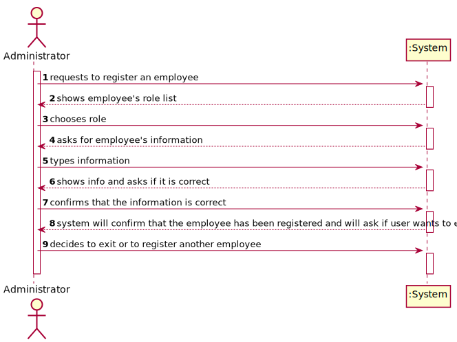
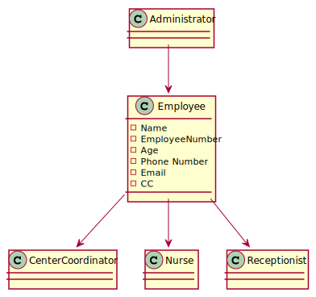
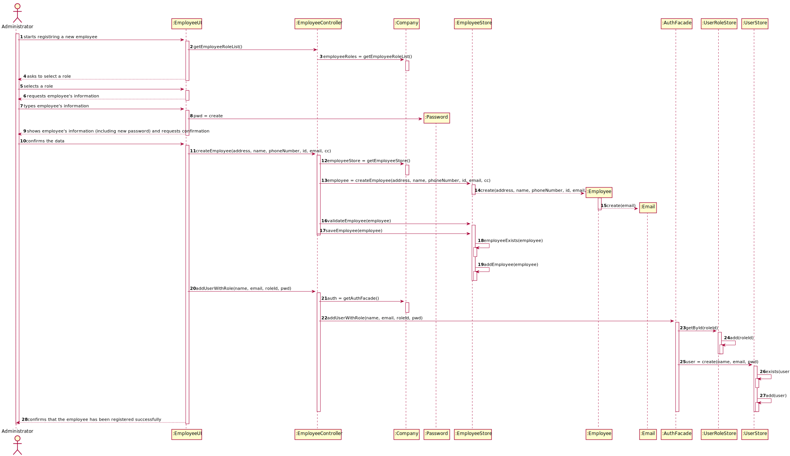
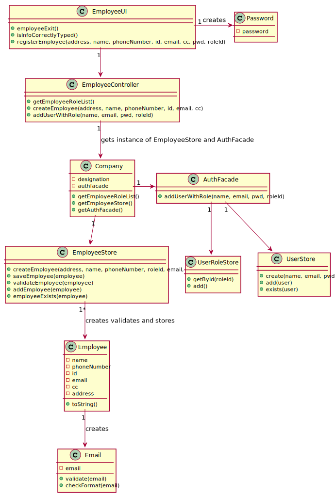

# US 010 - Register an Employee

## 1. Requirements Engineering

### 1.1. User Story Description

*As an administrator, I want to register an Employee.*

### 1.2. Customer Specifications and Clarifications 

#### Customer Specifications

**From the Specifications Document:**
- "[...]Any Administrator uses the application to register centers, SNS users, center coordinators, receptionists, and nurses enrolled in the vaccination process."
- "[...]All those who wish to use the application must be authenticated with a password holding seven alphanumeric characters, including three capital letters and two digits"

**From the Client's clarifications:**
- Question : what attributes does the employee have?
    - Answer : "Employee attributes: Id (automatic), Name, address, phone number, e-mail and Citizen Card number."
- Question : what roles can an employee have?
    - Answer :  "Every Employee has only one role (Coordinator, Receptionist, Nurse)." 
- Question : is the password generated automatically or specified by the user operating the system?
    - Answer : "The password should be generated automatically."
- Question : what is the correct format for the employee's citizen card number and his phone number? Should we consider that these follow the portuguese format?
    - Answer : "Consider that these two attributes follow the portuguese format"
- Question : If the role is not an employee attribute how is the employee's role determined? Is it specified by the user?
    - Answer : waiting for a response
- Question : How should the employee id be generated? What format will this follow?
    - Answer : waiting for a response

### 1.3. Acceptance Criteria

- **AC1:** *The Administrator must become a system user.* 
- **AC2:** *The "auth" component avaible on the repository must be reused (without modifications).*
- **AC3:** *The password and the id should be randomly generated*

### 1.4. Found out Dependencies

*No dependencies were found.*

### 1.5 Input and Output Data

####Input Data 

*Typed Data*
- Name
- Employee id
- Phone Number
- E-mail
- Citizen Card Number
- Address

*Selected Data*
- User role

####Output Data

- Confirmation that the employee has been registered in the system

### 1.6. System Sequence Diagram (SSD)

### 1.7 Other Relevant Remarks

## 2. OO Analysis

### 2.1. Relevant Domain Model Excerpt 

### 2.2. Other Remarks

## 3. Design - User Story Realization 

### 3.1. Rationale

| Interaction ID                                                                                                       | Question: Which class is responsible for...                                                                       | Answer             | Justification (with patterns)                                                                                               |
|:---------------------------------------------------------------------------------------------------------------------|:------------------------------------------------------------------------------------------------------------------|:-------------------|:----------------------------------------------------------------------------------------------------------------------------|
| Step 1 : requests to register an employee                                                                            | ...coordinating the US                                                                                            | EmployeeController | Controller                                                                                                                  |
|                                                                                                                      | ...interacting with the actor                                                                                     | EmployeeUI         | Pure Fabrication: there is no reason to assign this responsibility to any existing class in the Domain Model.               |
|                                                                                                                      | ...instatiating an employee                                                                                       | EmployeeStore      | Creator   LC & HC: we look to decrease the responsibilities assign to the the Company class                              |
| Step 2: shows employee's role list                                                                                   | ...storing the employee's roles                                                                                   | RoleStore          | IE: the roles are defined by the RoleStore.                                                                                 |
| Step 3: chooses role                                                                                                 | ...saving the employee's role                                                                                     | EmployeeController | IE: after an employee is created, the controller directs the role to AuthFacade so an user for the employee can be created. |
| Step 4 : asks for employee's information 		                                                                          | ... requesting information to the user?						                                                                     | EmployeeUI         | IE: is responsible for user interactions.                                                                                   |
| Step 5 : types information	                                                                                          | ...saving the information?					                                                                                   | Employee           | IE: object created has its own data.                                                                                        |
| Step 6 : shows employee's information and requests confirmation		                                                    | ...printing the information and asking for confirmation?							                                                   | EmployeeUI         | IE: is responsible for user interactions.                                                                                   |
| Step 7 : confirms that the information is correct		                                                                  | ...reading the answer?						                                                                                      | EmployeeUI         | IE: is responsible for user interactions.                                                                                   |                                                                                                               
|                                                                                                                      | ... validating the employee that was created?                                                                     | EmployeeStore      | IE: knows employee's data.                                                                                                  |
|                                                                                                                      | ... checking if the employee already exists                                                                       | EmployeeStore      | IE: knows all employees.                                                                                                    |
|                                                                                                                      | ... saving the employee that was created?                                                                         | EmployeeStore      | IE: owns all its employees.                                                                                                 |
|                                                                                                                      | ... creating an User for the employee with his information?                                                       | AuthFacade         | IE: calls the necessary methods                                                                                             |
|                                                                                                                      | ... saving the employee's role                                                                                    | UserRoleStore      | IE: knows all roles.                                                                                                        |
|                                                                                                                      | ... checking if the user already exists                                                                           | UserStore          | IE: knows all users.                                                                                                        | 
|                                                                                                                      | ... saving the employee's user                                                                                    | UserStore          | IE: owns all its employees.                                                                                                 |
| Step 8 :  system will confirm that the employee has been registered successfully and will ask if user wants to exit	 | ...printing confirmation and exit menu?							                                                                    | EmployeeUI         | IE: is responsible for user interactions.                                                                                   |              
| Step 9 : decides to exit or to register another employee 		                                                          | ...reading the answer?							                                                                                     | EmployeeUI         | IE: is responsible for user interactions.                                                                                   |

### Systematization ##

According to the taken rationale, the conceptual classes promoted to software classes are:
 * Employee
 * EmployeeStore
 * RoleStore
 * UserStore
 
Other software classes (i.e. Pure Fabrication) identified: 
 * EmployeeUI  
 * EmployeeController

## 3.2. Sequence Diagram (SD)

## 3.3. Class Diagram (CD)

# 4. Tests 

**I will assume that the id is a 5 digit number (question wasn't answered yet)**

**Test 1:** Check that it is possible to create an instance of the Employee class with valid values.
    
    @Test
      public void registerValidEmployee() {
      EmployeeStore store = new EmployeeStore();
      Employee employeeA =new Employee("00000","aaaa", "moradaA", "351912345678","coisa@isep.pt","39849069-4-ZV7");
      //value should be true because values are valid
      Assert.assertTrue(store.validateEmployee(employeeA));
    }

**Test 2:** Check that it is not possible to create an instance of the Employee class with null values.

     @Test (expected = IllegalArgumentException.class)
    public void RegisterEmployeeBlank() {
        Employee employeeB = new Employee(null,null,null, null,null,null,null);
    }  

**Test 3:** Attributes of any employee are unique.

      @Test
    public void validateCreateEqualEmployees() {
        EmployeeStore store = new EmployeeStore();
        Employee employeeC =new Employee("11111","bbbb", "moradaB", "351912345678","coisa@isep.pt","39849069-4-ZV7");
        store.add(employeeC);
        //employee already exists so value should be true
        Assert.assertTrue(store.exists(employeeC));
    }

**Test 4:** Employee has a specific email format.

    @Test(expected = IllegalArgumentException.class)
    public void CreateEmployeeEmailWrongFormat() {
        EmployeeStore store = new EmployeeStore();
        Employee employee1 = new Employee("22222","cccc","moradaC", "351912345678","coisa@isep","39849069-4-ZV7");
        //value should be false because email is in the wrong format
        Assert.assertFalse(store.validateEmployee(employee1));
    }
**Test 5:** Employee has a specific cc format.
    
    @Test(expected = IllegalArgumentException.class)
    public void CreateEmployeeCCWrongFormat() {
      EmployeeStore store = new EmployeeStore();
      Employee employee1 = new Employee("22222","cccc","moradaC", "351912345678","coisa@isep.pt","11111111111111");
      //value should be false because cc is in the wrong format
      Assert.assertFalse(store.validateEmployee(employee1));
    }

**Test 6:** Employee has a specific phone number format

    @Test(expected = IllegalArgumentException.class)
    public void CreateEmployeePhoneNumberWrongFormat() {
      EmployeeStore store = new EmployeeStore();
      Employee employee1 = new Employee("22222","cccc","moradaC", "111111111111","coisa@isep.pt","39849069-4-ZV7");
      //value should be false because phone number is in the wrong format
      Assert.assertFalse(store.validateEmployee(employee1));
    }
    

# 5. Construction (Implementation)

# 6. Integration and Demo 

# 7. Observations

