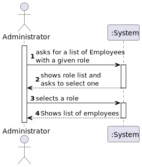
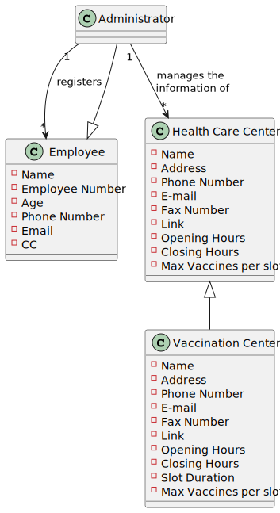
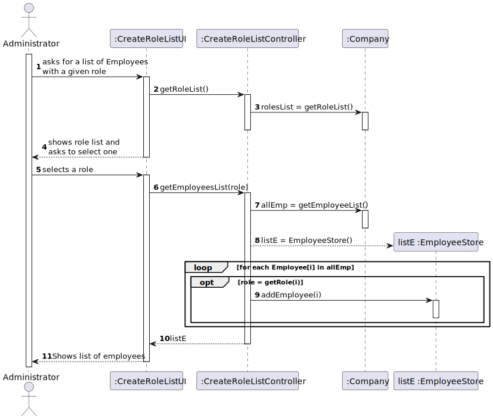
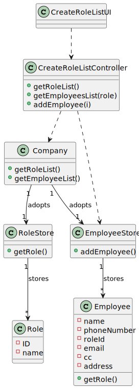

# US11 - To get a list of Employees with a given function/role

## 1. Requirements Engineering

### 1.1. User Story Description

As an Administrator, I want to get a list of Employees with a given function/role.
### 1.2. Customer Specifications and Clarifications 

**From the specifications document:**

 > "Any Administrator uses the
    application to register centers, SNS users, center coordinators, receptionists, and nurses enrolled in
    the vaccination process."
 

**From the client clarifications:** 
    
##### Question 1
  
>**Question:**
>Should we give the user the possibility of listing employees from more than 1 role?
 
>**Answer:**
>The Administrator should select a given role and all employees associated with the selected role should be listed.

>**Link:**
>https://moodle.isep.ipp.pt/mod/forum/discuss.php?d=15711#p20186
##### Question 2
  
>**Question:**
>Should the list be sorted in any specific way(for example alphabetical name order) or should we give the option to sort by other characteristics?

>**Answer:**
>For now I just want to get a list of employees without considering the order of presentation.

>**Link:**
>https://moodle.isep.ipp.pt/mod/forum/discuss.php?d=15711#p20186

##### Question 3

>**Question:**
>Besides the name of the employee, what other attributes do we need to show on the list? Can we show every single attribute, including password and username?

>**Answer:**
>The application should present all Employee attributes.
Password is not an Employee attribute.

>**Link:** 
> https://moodle.isep.ipp.pt/mod/forum/discuss.php?d=16007#p20563

### 1.3. Acceptance Criteria
* **AC1:** The role must be selected data.

### 1.4. Found out Dependencies

There's a dependency to the "US10 - As an Administrator,
 I want to register a Employee" since the employees 
 and their roles have to be registered first so that 
 lists of employees of a certain role can be done.

### 1.5 Input and Output Data

**Input Data:**

* Selected data:
   * Role
    
**Output Data:** 

   * List of employees

### 1.6. System Sequence Diagram (SSD)

## 2. OO Analysis

### 2.1. Relevant Domain Model Excerpt 
*In this section, it is suggested to present an excerpt of the domain model that is seen as relevant to fulfill this requirement.* 

## 3. Design - User Story Realization 

### 3.1. Rationale

**The rationale grounds on the SSD interactions and the identified input/output data.**

| Interaction ID | Question: Which class is responsible for... | Answer  | Justification (with patterns)  |
|:-------------  |:--------------------- |:------------|:---------------------------- |
| Step 1: asks for a list of Employees with a given role | ... interacting with the actor? | CreateRoleListUI | **Pure Fabrication:** there is no reason to assign this responsibility to any existing class in the Domain Model. |
| |... coordinating the US? |CreateRoleListController|  Controller |
| |getting the roles|RoleStore|**IE:** knows all the roles in the system|
| Step 2: shows role list and asks to select one| | |
| Step 3: selects a role | getting a list of employees|EmployeeStore|**IE:** knows all the employees in the system|
| Step 4: Shows list of employees |	  |   |              
		

### Systematization ##

According to the taken rationale, the conceptual classes promoted to software classes are: 

 * RoleStore
 * EmployeeStore
 * Company

Other software classes (i.e. Pure Fabrication) identified: 
 * CreateRoleListUI  
 * CreateRoleListController

## 3.2. Sequence Diagram (SD)

## 3.3. Class Diagram (CD)

# 4. Tests 
*In this section, it is suggested to systematize how the tests were designed to allow a correct measurement of requirements fulfilling.* 

**_DO NOT COPY ALL DEVELOPED TESTS HERE_**

**Test 1:** Check that it is not possible to create an instance of the Example class with null values. 

	@Test(expected = IllegalArgumentException.class)
		public void ensureNullIsNotAllowed() {
		Exemplo instance = new Exemplo(null, null);
	}

*It is also recommended to organize this content by subsections.* 

# 5. Construction (Implementation)

*In this section, it is suggested to provide, if necessary, some evidence that the construction/implementation is in accordance with the previously carried out design. Furthermore, it is recommeded to mention/describe the existence of other relevant (e.g. configuration) files and highlight relevant commits.*

*It is also recommended to organize this content by subsections.* 

# 6. Integration and Demo 

- A new option was added in the Admin Menu

# 7. Observations

