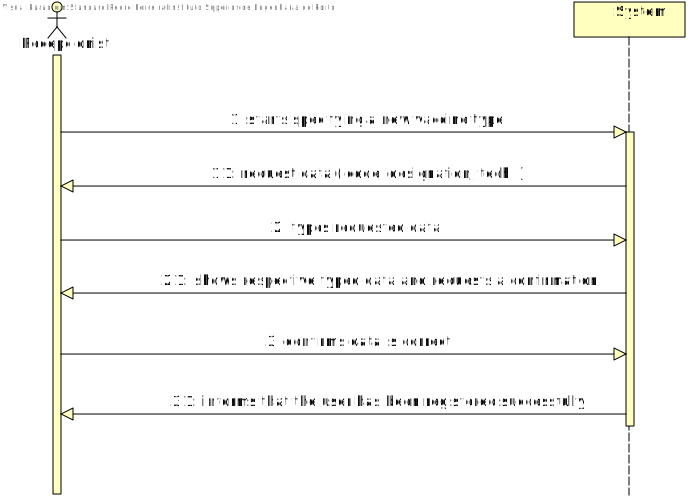
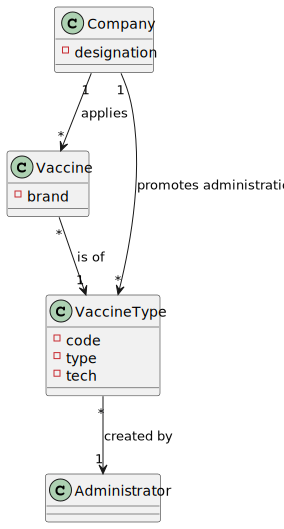
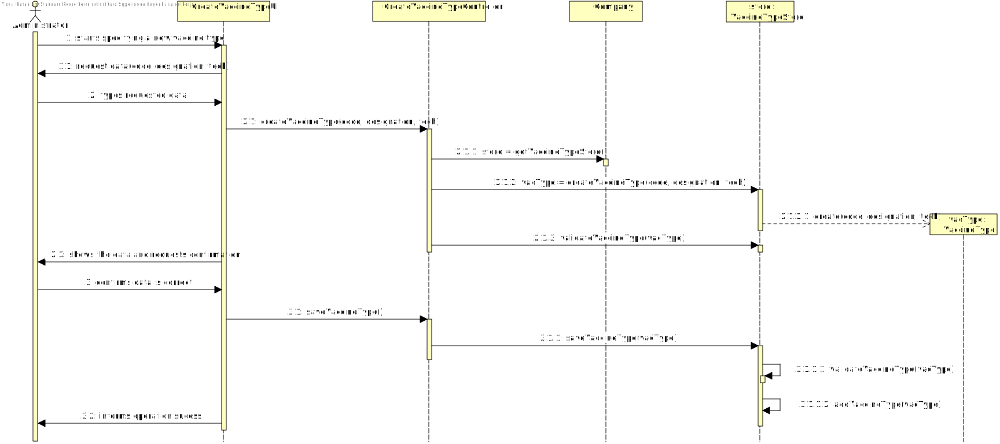
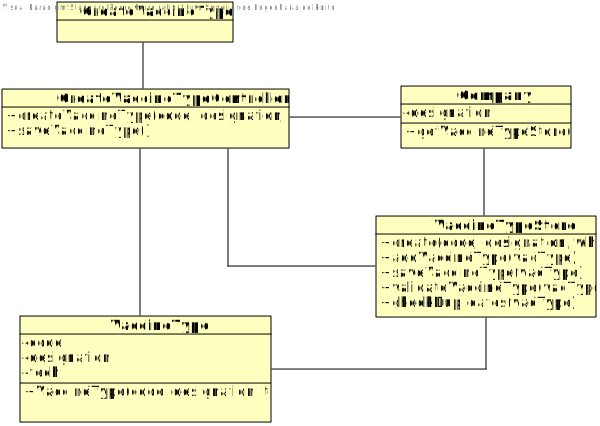

# US 012 - To specify a new vaccine type

## 1. Requirements Engineering

### 1.1. User Story Description

- *As an administrator, I intend to specify a new vaccine type.*

### 1.2. Customer Specifications and Clarifications 

#### From the specifications document :
- “[…] the community mass vaccination centers are facilities specifically created to administer vaccines of a single type […]”
- “[…] healthcare center […] can administer any type of vaccines (e.g.: Covid-19, Dengue, Tetanus, smallpox).”
- “[…] for each type of vaccine, it might exist several vaccines […]”

#### From the client clarifications : 
- Question:  "What kind of information would you like to include in a new type of vaccine?"
  - Answer: The vaccine type should have the following attributes: Code (five alphanumeric characters), Short description and Vaccine technology. Please check the web page above to identify the six types of vaccine technologies that can be selected.
    https://www.pfizer.com/news/articles/understanding_six_types_of_vaccine_technologies

### 1.3. Acceptance Criteria

- **AC1:** Code must be unique having 5 chars
- **AC2:** Designation must be short
- **AC3:** Vaccine technology must be chosen from a list of a total six options according to "https://www.pfizer.com/news/articles/understanding_six_types_of_vaccine_technologies"

### 1.4. Found out Dependencies

No dependencies were found.

### 1.5 Input and Output Data

#### Input Data
  - **Typed Data:** 
    - code
    - designation
  - **Selected Data:**
    - tech

#### Output Data
  - (In)Success of the operation

### 1.6. System Sequence Diagram (SSD)

### 1.7 Other Relevant Remarks

*Use this section to capture other relevant information that is related with this US such as (i) special requirements ; (ii) data and/or technology variations; (iii) how often this US is held.* 

## 2. OO Analysis

### 2.1. Relevant Domain Model Excerpt 

### 2.2. Other Remarks

*Use this section to capture some aditional notes/remarks that must be taken into consideration into the design activity. In some case, it might be usefull to add other analysis artifacts (e.g. activity or state diagrams).* 

## 3. Design - User Story Realization 

### 3.1. Rationale

**The rationale grounds on the SSD interactions and the identified input/output data.**

| Interaction ID | Question: Which class is responsible for... | Answer  | Justification (with patterns)  |
|:-------------  |:--------------------- |:------------|:---------------------------- |
| Step 1  		 |...interacting with the administrator?							 |CreateVaccineTypeUI             |**Pure Fabrication:**  there is no reason to assign this responsibility to any existing class in the Domain Model                              |
|   		 |...coordinating the US003?							 |CreateVaccineTypeController             |**Controller**                              |
| Step 2  		 |...saving the typed data							 |VaccineType             |**IE:** a VaccineType knows its own data                              |
|  		 |... instantiating a new VaccineType?							 |VaccineTypeStore             |**HC+LC:** by applying this method we are moving the responsibilities that were on "Company" to the "VaccineTypeStore"                              |
|   		 |... knowing VaccineTypeStore?							 |Company             |**IE:** Company knows the VaccineTypeStore to which it is delegating some tasks                              |
| Step 3  		 |... validating all data (local validation)?							 |VaccineType             |**IE:** an object knows its data                               |              
|   		 |... validating all data (global validation)?							 |VaccineTypeStore             |**IE:** knows all Vaccine types                               |
|   		 |... saving the VaccineType?						 |VaccineTypeStore             |**IE:** knows all Vaccine types                             |
| Step 4  		 |... informing operation (in)success?							 |CreateVaccineTypeUI             |**IE:** is responsible for user interactions                              |
  

### Systematization ##

According to the taken rationale, the conceptual classes promoted to software classes are: 

 * VaccineType
 * Company

Other software classes (i.e. Pure Fabrication) identified: 
 * CreateVaccineTypeUI  
 * CreateVaccineTypeController
 * VaccineTypeStore

## 3.2. Sequence Diagram (SD)

## 3.3. Class Diagram (CD)

# 4. Tests 

**_DO NOT COPY ALL DEVELOPED TESTS HERE_**

**Test 1:** Check that is possible to create an instance of the VaccineType with valid values.

    @Test
        public void createValidVaccineType() {
        VaccineType test = new VaccineType(18115, "Pfizer-BioNTech", "Toxoid");
        Assert.assertNotNull(test);
    }

**Test 2:** Check that it is not possible to create an instance of the VaccineType class with null values. 

	@Test(expected = IllegalArgumentException.class)
		public void ensureNullIsNotAllowed() {
		VaccineType test = new VaccineType(null, null, null);
	}

**Test 3:** Check that is not possible to create an instance of the VaccineType class with a negative number on code attribute.

    @Test(expected = IllegalArgumentException.class)
        public void createVaccineTypeNegativeNumber() {
        VaccineType test = new VaccineType(-12345, "Pfizer-BioNTech", "Toxoid");
    }

**Test 4:** Check that is not possible to create an instance of the VaccineType class with a code of 8 digits.

    @Test(expected = IllegalArgumentException.class)
        public void createVaccineTypeWith8DigitsCode() {
        VaccineType test = new VaccineType(23875600, "Pfizer-BioNTech", "Toxoid");
    }

# 5. Construction (Implementation)
n/a

# 6. Integration and Demo 
n/a

# 7. Observations

n/a

