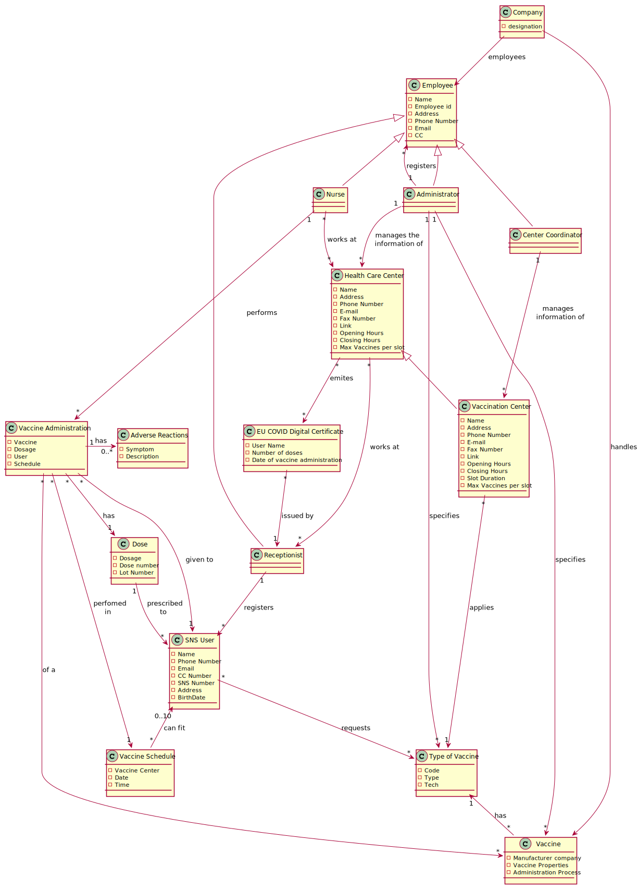

# OO Analysis #

## Rationale to identify domain conceptual classes ##

### _Conceptual Class Category List_ ###

**Business Transactions**

* Vaccine

---

**Transaction Line Items**

* Vaccine

---

**Roles of People or Organizations**

* Administrator
* Nurse
* Recepcionist
* Center Coordinator
* Employee
* SNS User

**Places**

* Vaccination Center
* Health Care Center

---

**Noteworthy Events**

* Vaccination Administration
* Adverse Reaction
* Vaccine Schedule

---

**Physical Objects**

* Vaccine

---

**Descriptions of Things**

*  Type of Vaccine
*  Dose

---

**Organizations**

* Company

---

**Documents mentioned/used to perform some work/**

* EU Covid Certificate
---

###**Rationale to identify associations between conceptual classes**

| Concept (A) 		         |         Association   	         |                  Concept (B) |
|------------------------|:-------------------------------:|-----------------------------:|
| Company                |            employees            |                     Employee |
| Company                |             handles             |                      Vaccine |
| Administrator          |              is an              |                     Employee |
| Administrator          | manages the core information of |           Health Care Center |
| Administrator          |            registers            |                     Employee |
| Administrator          |            specifies            |                      Vaccine |
| Center Coordinator     |              is an              |                     Employee |
| Center Coordinator     |     manages information of      |           Vaccination Center |
| Health Care Center     |               has               |           Vaccination Center |
| Health Care Center     |             emites              | EU COVID Digital Certificate |
| Vaccination Center     |             applies             |              Type of Vaccine |
| Receptionist           |              is an              |                     Employee |
| Receptionist           |            works at             |           Health Care Center |
| Receptionist           |             issues              | EU COVID Digital Certificate |
| Receptionist           |            registers            |                     SNS User |
| SNS User               |            requires             |              Type of Vaccine |
| Vaccine Schedule       |             can fit             |                     SNS User |
| Nurse                  |              is an              |                     Employee |
| Nurse                  |            works at             |           Health Care Center |
| Nurse                  |            performs             |       Vaccine Administration |
| Vaccine Administration |           given to a            |                     SNS User |
| Vaccine Administration |              in a               |             Vaccine schedule |
| Vaccine Administration |               has               |            Adverse Reactions |
| Vaccine Administration |              of a               |                      Vaccine |
| Vaccine Administration |               has               |                         Dose |
| Dose                   |          prescribed to          |                     SNS User |
| Vaccine                |               has               |              Type of Vaccine |

## Domain Model

