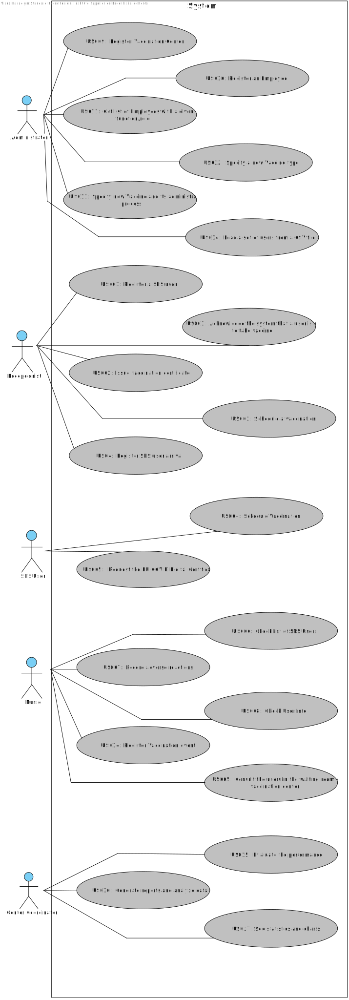

# Use Case Diagram (UCD)

# Use Cases / User Stories
| UC/US                | Description                                                                                                  |                   
|:---------------------|:-------------------------------------------------------------------------------------------------------------|
| [US01](US01/US01.md) | As a SNS user, I intend to use the application to schedule a vaccine.                                        |
| [US02](US02/US02.md) | As a Receptionist at one vaccination center, I want to schedule a vaccination.                               |                                                                                             
| [US03](US03/US03.md) | As a Receptionist, I want to register a SNS User.                                                            |
| [US04](US04/US04.md) | As a Receptionist at a vaccination center, I want to register the arrival of a SNS user to take the vaccine. |
| [US05](US05/US05.md) | As a Nurse, I intend to consult the users in the waiting room of a vaccination center.                       |                                
| [US09](US09/US09.md) | As an Administrator, I want to register a vaccination center to respond to a certain pandemic.               |
| [US10](US10/US10.md) | As an Administrator, I want to register an Employee.                                                         |
| [US11](US11/US11.md) | As an Administrator, I want to get a list of Employees with a given function/role.                           |
| [US12](US12/US12.md) | As an Administrator, I intend to specify a new vaccine type.                                                 |
| [US13](US13/US13.md) | As an Administrator, I intend to specify a new vaccine and its administration process.                       |
| [US14](US14/US14.md) | As an Administrator, I want to load a set of users from a CSV file.                                          |

