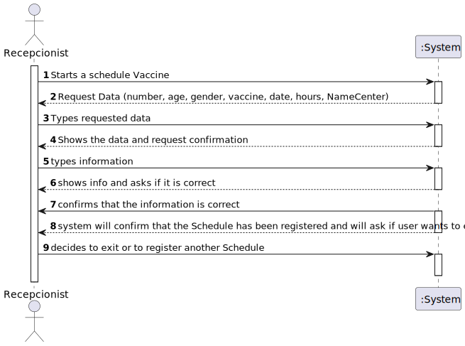

# US 02 - *As a receptionist at one vaccination center, I want to schedule a vaccination.

## 1. Requirements Engineering

*In this section, it is suggested to capture the requirement description and specifications as provided by the client as well as any further clarification on it. It is also suggested to capture the requirements acceptance criteria and existing dependencies to other requirements. At last, identify the involved input and output data and depicted an Actor-System interaction in order to fulfill the requirement.*

### 1.1. User Story Description

*As a receptionist at one vaccination center, I want to schedule a vaccination.*

### 1.2. Customer Specifications and Clarifications 

 **Question: When a receptionist schedules a vaccination for an SNS user, should they be presented with a list of available vaccines (brands, that meet acceptance criteria) from which to choose? Or should the application suggest only one?"**

 *Answer: The receptionist do not select the vaccine brand.
 When the user is at the vaccination center to take the vaccine, the nurse selects the vaccine. In Sprint D we will introduce new USs where the nurse records the administration of a vaccine to a SNS user.*

 **Question: "Regarding US02, i would like to know if a receptionist has the ability to schedule an appointment in different vaccination centres or only on their own."**

 *Answer: The receptionist has the ability to schedule the vaccine in any vaccination center. The receptionist should ask the SNS user to indicate/select the preferred vaccination center.*

### 1.3. Acceptance Criteria

**AC1:** The algorithm should check if the SNS User is within the
  age and time since the last vaccine.

### 1.4. Found out Dependencies

*There is a dependency to "US01: As a SNS user, I intend to use the application to schedule a vaccine"*

### 1.5 Input and Output Data

- **Typed Data:**
- Number
- Birthdate
- Gender
- Vaccine
- Date
- Hours

###Output Data
- *Confirms if the data given by a recepcionist is corret*
- *Check if they have schedules in the same date and hour*
- *Confirms that the schedule was registered with success or no*

### 1.6. System Sequence Diagram (SSD)

*Insert here a SSD depicting the envisioned Actor-System interactions and throughout which data is inputted and outputted to fulfill the requirement. All interactions must be numbered.*

### 1.7 Other Relevant Remarks

>*The recepcionist can´t schedule vaccination on the same date and time*

## 2. OO Analysis

### 2.1. Relevant Domain Model Excerpt 
*In this section, it is suggested to present an excerpt of the domain model that is seen as relevant to fulfill this requirement.* 

### 2.2. Other Remarks

n/a

## 3. Design - User Story Realization 

### 3.1. Rationale

**The rationale grounds on the SSD interactions and the identified input/output data.**

| Interaction ID | Question: Which class is responsible for...  | Answer                                  | Justification (with patterns)                                                                                     |
|:---------------|:---------------------------------------------|:----------------------------------------|:------------------------------------------------------------------------------------------------------------------|
| Step 1  		     | 	...Interacting with the recepcionist					   | ScheduleVaccineUI                       | **Pure Fabrication:** there is no reason to assign this responsibility to any existing class in the Domain Model. |
|   		           | ...Coordinating the US?							               | ScheduleVaccineController               | **Controller**                                                                                                    |
| Step 3  		     | 	...saving the input data?						             | ScheduleVaccine                         | Schedule knows its own data                                                                                       |
| Step 4  		     | ...validate the data?					                   | ScheduleVaccine && ScheduleVaccineStore | ScheduleVaccine knows the local data, ScheduleVaccineStore knows all Schedules                                    |
| Step 5  		     | 	...saving the created ScheduleVaccine						 | ScheduleVaccineStore                    | knows all schedules                                                                                               |
| Step 6  		     | 	...informing operation sucess?						        | ScheduleVaccineUI                       | ui is responsible for showing the user that the schedule was created successfully                                 |              
| Step 7  		     | 							                                      |                                         |                                                                                                                   |
| Step 8  		     | 							                                      |                                         |                                                                                                                   |
| Step 9  		     | 							                                      |                                         |                                                                                                                   |
| Step 10  		    | 							                                      |                                         |                                                                                                                   |  

### Systematization ##

According to the taken rationale, the conceptual classes promoted to software classes are: 

 * Class ScheduleVaccine
 * Class Company

Other software classes (i.e. Pure Fabrication) identified: 
 * ScheduleVaccineUI  
 * ScheduleVaccineController
 * ScheduleVaccineStore

## 3.2. Sequence Diagram (SD)

*In this section, it is suggested to present an UML dynamic view stating the sequence of domain related software objects' interactions that allows to fulfill the requirement.* 

## 3.3. Class Diagram (CD)

*In this section, it is suggested to present an UML static view representing the main domain related software classes that are involved in fulfilling the requirement as well as and their relations, attributes and methods.*

# 4. Tests 
*In this section, it is suggested to systematize how the tests were designed to allow a correct measurement of requirements fulfilling.* 

**_DO NOT COPY ALL DEVELOPED TESTS HERE_**

**Test 1:** Check that it is possible to create an instance of the ScheduleVaccine class with valid values.

	@Test
      public void create(){
      ScheduleVaccine SchedulevaccineA = new ScheduleVaccine("123456789", "10/10/2002", "masculine", "pfizer", "10/10/2022", "10:10", "ASas");
      Assert.assertNotNull(ScheduleVaccineA);
	}
**Test 2:** Check that it is not possible to create an instance of the ScheduleVaccine class with null values.

    @Test
      public void create(){
      ScheduleVaccine SchedulevaccineA = new ScheduleVaccine(null, null, null, null, null, null, null);
      Assert.assertNotNull(ScheduleVaccineA);
	}

**Test 3:** Check that it is not possible to create an instance of the VC class with negative ID and hour values.

    @Test
      public void create(){
      ScheduleVaccine SchedulevaccineA = new ScheduleVaccine("123456789", "10/10/2002","masculine", "pfizer", "10/10/2022", -20:10, "ASas");
      Assert.assertNotNull(ScheduleVaccineA);
	}

**Test 4:** Check that it is not possible to create an instance of the VC class with more than 9 digits in Number values.

    @Test
      public void create(){
      ScheduleVaccine SchedulevaccineA = new ScheduleVaccine("1234567890101", "10/10/2002", "masculine", "pfizer", "10/10/2022", "10:10", "ASas");
      Assert.assertNotNull(ScheduleVaccineA);
	}

# 5. Construction (Implementation)

n/a

# 6. Integration and Demo 

n/a

# 7. Observations

n/a

