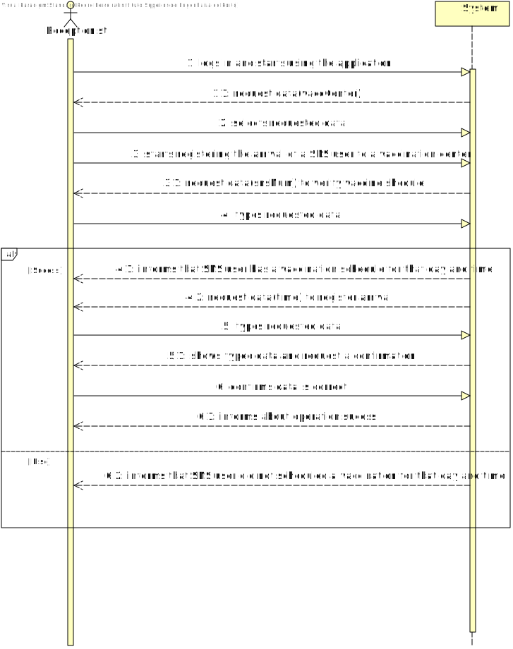
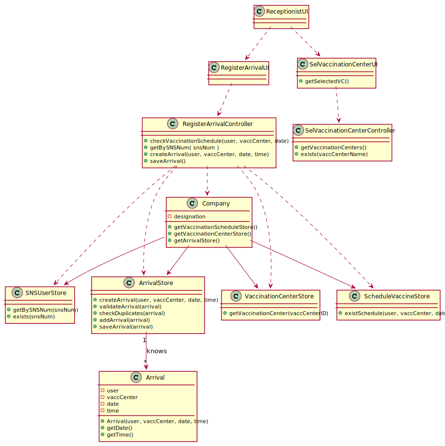
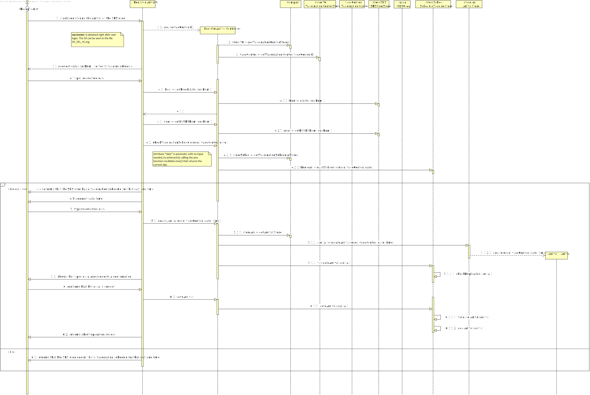
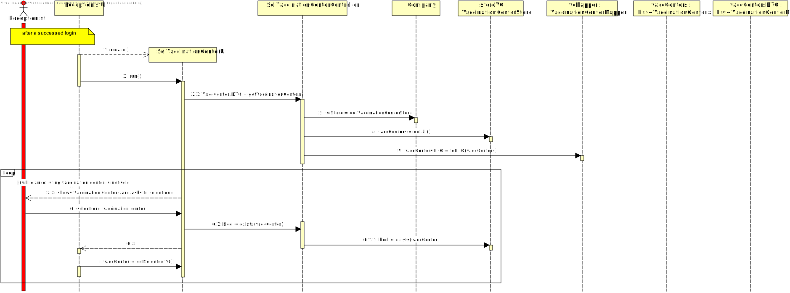

# US 004 - To register the arrival of an SNS user

## 1. Requirements Engineering

### 1.1. User Story Description

- As a receptionist at a vaccination center, I want to register the arrival of a SNS user to take the vaccine.

### 1.2. Customer Specifications and Clarifications 

#### From the specifications document:

- "When the SNS user arrives at the vaccination center, a receptionist registers the arrival of the user to
  take the respective vaccine."

- "The receptionist asks the SNS user for his/her SNS user number and
  confirms that he/she has the vaccine scheduled for the that day and time."

- "If the information is correct, the receptionist acknowledges the system that the user is ready to take the vaccine."

#### From the client clarifications :

>- **Question:** "Regarding US04, what are the attributes needed in order to register the arrival of a SNS user to a vaccination center".
>- **Answer:** The time of arrival should be registered.

>- **Question:** "Regarding US04, a receptionist register the arrival of a SNS user immediately when he arrives at the vaccination center or only after the receptionist confirms that the respective user has a vaccine schedule for that day and time."
>- **Answer:** The receptionist registers the arrival of a SNS user only after confirming that the user has a vaccine scheduled for that day and time.

>- **Question:** "The receptionist must have the possibility to choose which center she wants to register the SNS user's arrival every time she uses this feature, or should we make the nurse pick a center after they log in?"
>- **Answer:** To start using the application, the nurse should first select the vaccination center where she is working.

>- **Question:** "Regarding US04, the attribute "arrival time" should be considered to let the user enter the waiting room.
  For example, a user that arrives 40 minutes after his appointment wont be allowed to enter the center, and another who only arrives 10 minutes late may proceed. If so, how much compensation time should we provide to the user."
>- **Answer:** In this sprint we are not going to address the problem of delays. All arriving users are attended and registered by the receptionist.

### 1.3. Acceptance Criteria

- **AC1:** No duplicate entries should be possible for the same SNS user on the same day or vaccine period.
- **AC2:** Receptionist must first select a vaccination center where she is currently working before registering the arrival.
- **AC3:** Receptionist must first verify if the SNS user has a vaccine schedule for that day before registering the arrival.

### 1.4. Found out Dependencies

- There is a dependency to "US001 and US002 : to schedule a vaccine" since the receptionist before registering the arrival of the SNS user, she must verify first if he/she has a vaccination schedule for that day and time.

### 1.5 Input and Output Data

#### Input Data
- **Typed Data:**
  - SNS number
  - Time
  
- **Selected Data:**
  - Vaccination Center

#### Output Data
- Informs about if an SNS user has a vaccine schedule for that day or not.
- Informs about the success or failure of the operation.

### 1.6. System Sequence Diagram (SSD)

### 1.7 Other Relevant Remarks

*Use this section to capture other relevant information that is related with this US such as (i) special requirements ; (ii) data and/or technology variations; (iii) how often this US is held.* 

## 2. OO Analysis

### 2.1. Relevant Domain Model Excerpt 

### 2.2. Other Remarks

*Use this section to capture some aditional notes/remarks that must be taken into consideration into the design activity. In some case, it might be usefull to add other analysis artifacts (e.g. activity or state diagrams).* 

## 3. Design - User Story Realization 

### 3.1. Rationale

**The rationale grounds on the SSD interactions and the identified input/output data.**

| Interaction ID | Question: Which class is responsible for...                                          | Answer                         | Justification (with patterns)                                                                                      |
|:---------------|:-------------------------------------------------------------------------------------|:-------------------------------|:-------------------------------------------------------------------------------------------------------------------|
| Step 1  		     | ...interacting with the receptionist during the vaccination center selection?							 | SelVaccinationCenterUI         | **Pure Fabrication:** there is no reason to assign this responsibility to any existing class in the Domain Model   |
|                | ...coordinating the selection of the vaccination center?| SelVaccinationCenterController| **Controller**|                                                                                                     |                           |
| |...transfering the data from the domain to the UI |VaccinationCenterDTO |**DTO:** When there is so much data to transfer, it is better to opt by using a DTO in order to reduce coupling between UI and domain |
| Step 2  		     | 							                                                                              |                                |                                                                                                                    |
| Step 3  		     | ...interacting with the receptionist?							                                         | RegisterArrivalUI              | **Pure Fabrication:** there is no reason to assign this responsibility to any existing class in the Domain Model   |
| 		             | ...coordinating the US004?							                                                    | RegisterArrivalController      | **Controller**                                                                                                     |
| Step 4  		     | ...verifying if a SNS user exists and return the user?							                        | SNSUserStore                   | **IE:** knows all SNS users                                                                                        |
| 		             | ...verifying the vaccine schedule of a SNS user?							                              | ScheduleVaccineStore           | **IE:** knows all vaccine schedules                                                                                |              
| 		             | ...informing if a SNS user has a vaccine schedule or not?							                     | RegisterArrivalUI              | **IE:** is responsible for user interactions                                                                       |
| Step 5  		     | ...saving the typed data?							                                                     | Arrival                        | **IE:** an arrival knows its own data                                                                              |
| 		             | ... instantiating a new Arrival?							                                              | ArrivalStore                   | **HC+LC:** by applying this method we are moving the responsibilities that were on "Company" to the "ArrivalStore" |
| 		             | ... knowing ArrivalStore?							                                                     | Company                        | **IE:** Company knows the ArrivalStore to which it is delegating some tasks                                        |  
| Step 6         | ... validating all data (local validation)?                                          | Arrival                        | **IE:** an object knows its data                                                                                   |
|                | ... validating all data (global validation)?                                         | ArrivalStore                   | **IE:** knows all Arrivals                                                                                         |
|                | ... saving the Arrival?                                                              | ArrivalStore                   | **IE:** knows all Arrivals                                                                                         |
| Step 7         | ... informing operation (in)success?                                                 | RegisterArrivalUI              | **IE:** is responsible for user interactions                                                                       |

### Systematization ##

According to the taken rationale, the conceptual classes promoted to software classes are:
 * Company
 * Arrival
 * Vaccination Center
 * SNSUser
 * Vaccine Schedule

Other software classes (i.e. Pure Fabrication) identified: 
 * RegisterArrivalUI
 * SelVaccinationCenterUI
 * SelVaccinationCenterController
 * RegisterArrivalController
 * ArrivalStore
 * SNSUserStore
 * ScheduleVaccineStore
 * VaccinationCenterStore

## 3.2. Sequence Diagram (SD)

## 3.3. Class Diagram (CD)

# 4. Tests 

**Test 1:** Check that is possible to create an instance of the Arrival with valid values.

    @Test
        public void createValidArrival() {
        Arrival test = new Arrival(user, vaccCenter, "2022-05-28", "18:00");
        Assert.assertNotNull(test);
    }

**Test 2:** Check that it is not possible to create an instance of the Arrival class with null values. 

	@Test(expected = IllegalArgumentException.class)
		public void ensureNullIsNotAllowed() {
		Arrival arrival = new Arrival(null, null, null, null);
	}

**Test 3:** Check that it is not possible to create an instance of the Arrival class with invalid time format.

    @Test(expected = IllegalArgumentException.class)
		public void ensureInvalidTimeFormatIsNotAllowed() {
		Arrival arrival = new Arrival(user, vaccCenter, "2022-05-28", "18:00:23");
	}

**Test 4:** Check the time format.

    @Test
		public void checkTimeFormat() {
		Arrival arrival;
        boolean test1 = arrival.checkTimeFormat("18:00");
        Assertions.assertTrue(test1);

        boolean test2 = arrival.checkTimeFormat("24:00");
        Assertions.assertFalse(test2);

        boolean test3 = arrival.checkTimeFormat("16:00:30");
        Assertions.assertFalse(test3);
	}

*It is also recommended to organize this content by subsections.* 

# 5. Construction (Implementation)

*In this section, it is suggested to provide, if necessary, some evidence that the construction/implementation is in accordance with the previously carried out design. Furthermore, it is recommeded to mention/describe the existence of other relevant (e.g. configuration) files and highlight relevant commits.*

*It is also recommended to organize this content by subsections.* 

# 6. Integration and Demo 

*In this section, it is suggested to describe the efforts made to integrate this functionality with the other features of the system.*

# 7. Observations

*In this section, it is suggested to present a critical perspective on the developed work, pointing, for example, to other alternatives and or future related work.*

