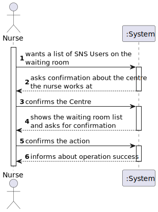

# US05 - Consult  Users in the Waiting Room of a Vacination Center.

## 1. Requirements Engineering

### 1.1. User Story Description

As a nurse, I intend to consult the users in the waiting room of a vacination center.
### 1.2. Customer Specifications and Clarifications 
#### From the specifications document:

- "... should send the SNS user to a waiting room where (s)he should wait for his/her
  time."
- "... a nurse responsible for administering the vaccine will use the application to check the
  list of SNS users that are present in the vaccination center to take the vaccine and will call one SNS
  user to administer him/her the vaccine."
- "... the user that has arrived firstly will be the first one
  to be vaccinated (like a FIFO queue)."

#### From the client clarifications :
>- **Question:** "We need to know if the nurse have to chose the vaccination center before executing the list or if that information comes from employee file?"
>- **Answer:** When the nurse starts to use the application, firstly, the nurse should select the vaccination center where she his working. The nurse wants to check the list of SNS users that are waiting in the vaccination center where she his working.

### 1.3. Acceptance Criteria

- **AC1:**  SNS Users’ list should be presented by order of arrival.

### 1.4. Found out Dependencies

There's a dependency to the "US4 - As a receptionist at a vaccination center, I want to register the arrival of a SNS user to take the vaccine".

### 1.5 Input and Output Data

**Output Data:**

* List of SNS Users on the waiting room

### 1.6. System Sequence Diagram (SSD)

### 1.7 Other Relevant Remarks
n/a

## 2. OO Analysis

### 2.1. Relevant Domain Model Excerpt 
*In this section, it is suggested to present an excerpt of the domain model that is seen as relevant to fulfill this requirement.* 

### 2.2. Other Remarks

n/a

## 3. Design - User Story Realization 

### 3.1. Rationale

**The rationale grounds on the SSD interactions and the identified input/output data.**

| Interaction ID                                                            | Question: Which class is responsible for... | Answer                    | Justification (with patterns)                                                                                     |
|:--------------------------------------------------------------------------|:--------------------------------------------|:--------------------------|:------------------------------------------------------------------------------------------------------------------|
| Step 1: wants a list of SNS Users on the                                  | interacting with the actor?                 | WaitingRoomListUI         | **Pure Fabrication:** there is no reason to assign this responsibility to any existing class in the Domain Model. |
|                                                                           | coordinating the US?                        | WaitingRoomListController | Controller                                                                                                        |
|                                                                           | knowing the Vaccination Centre?             | WaitingRoomListUI         | **IE:** The centre is selected at the NurseUI and sent to the WaitingRoomListUI                                   |
| Step 2: asks confirmation about the centre (vacCenter) the nurse works at | 							                                     |                           |                                                                                                                   |
| Step 3: confirms the Centre   		                                          | 	getting all the arrivals?                  | ArrivalStore              | **IE:** knows all the arrivals in the system                                                                      |                                                                           |                                                                                                                   |
| Step 4: shows the waiting room list and asks for confirmation             |                                             | 							                   |                                                                                                                   |                                                                                                                   |
| Step 5: confirms the action                                               | 	knowing the confirmation answer?           | WaitingRoomListUI         | **IE:** this is a simple confirmation of wanting to return to the Nurse Menu; it´s done on the UI                 |
| Step 6: informs about operation success 	                                 | 							                                     |                           |                                                                                                                   |              

### Systematization ##

According to the taken rationale, the conceptual classes promoted to software classes are: 

 * Company
 * ArrivalStore

Other software classes (i.e. Pure Fabrication) identified: 
 * WaitingRoomListUI  
 * WaitingRoomListController

## 3.2. Sequence Diagram (SD)

## 3.3. Class Diagram (CD)

*In this section, it is suggested to present an UML static view representing the main domain related software classes that are involved in fulfilling the requirement as well as and their relations, attributes and methods.*

# 4. Tests 
*In this section, it is suggested to systematize how the tests were designed to allow a correct measurement of requirements fulfilling.* 

**_DO NOT COPY ALL DEVELOPED TESTS HERE_**

**Test 1:** Checks if the method filteringByVaccCentreTest() is working correctly

        @Test
        public void filteringByVaccCentreTest() {
        SNSUserStore user = new SNSUserStore();
        SNSUser u1 = user.createSNS("ana","female", "21/03/2000", "rua 1", "915555556", "email@hotmqi.com", "111111111", "11111111-1-AA1");
        SNSUser u2 = user.createSNS("anasois","female", "21/04/1999", "rua 2", "915555455", "email@htmqil.com", "111111112", "11111111-1-AA2");
        SNSUser u8 = user.createSNS("anaoito","female", "01/08/2002", "rua 9", "915550255", "emal@hotmqi.com", "111111118", "11111511-1-AA6");

        Schedule s = new Schedule("09:00", "19:00");
        VaccinationCenter vc = new VaccinationCenter("nome", "maail@mail.com", "914444444", "rua", "www.fff.com", 9144444, "tétano", 10.0, 1, s);
        VaccinationCenter vc2 = new VaccinationCenter("nammme", "mail@mail.com", "914444744", "rua 2", "www.fffkk.com", 9144454, "tétano", 10.0, 1, s);

        ArrivalStore list = new ArrivalStore();
        Arrival a1 = new Arrival(u1, vc, String.valueOf(LocalDate.now()), "12:00");
        list.addArrival(a1);
        Arrival a2 = new Arrival(u2, vc, String.valueOf(LocalDate.now()), "12:15");
        list.addArrival(a2);

        Arrival a8 = new Arrival(u8, vc2, String.valueOf(LocalDate.now()), "11:15");
        list.addArrival(a8);

        ArrivalStore actual = list.filterByVaccCentre(vc2.getName());
        ArrivalStore expected = new ArrivalStore();
        expected.addArrival(a8);

        Assertions.assertEquals(actual.toString(), expected.toString());
    }
    

**Test 2:** Checks if the ArrivalStore is an empty list

	@Test
    public void isEmptyTest() {
        ArrivalStore store = new ArrivalStore();
        Assertions.assertTrue(store.isEmpty());
    }

# 5. Construction (Implementation)

##WaitingRoomListController
    package app.controller;
    
    import app.domain.model.Company
    import app.domain.stores.ArrivalStore;
    
    
    public class WaitingRoomListController {
    private Company company;
    private ArrivalStore allArrivals;

      public WaitingRoomListController() {
          this.company = App.getInstance().getCompany();
          this.allArrivals = this.company.getArrivalStore();
      }
  
      public ArrivalStore getArrivals(String vc){
          ArrivalStore store = this.allArrivals.filterByVaccCentre(vc);
          return store.orderByArrival();
      }
  
      public String waitingRoomListing(ArrivalStore list){
          return list.print();
      }

    }
##WaitingRoomListUI
    package app.ui.console;
    
    import app.controller.WaitingRoomListController;
    import app.domain.stores.ArrivalStore;
    import app.ui.console.utils.Utils;
    
    public class WaitingRoomListUI implements Runnable{
    private WaitingRoomListController ctrl;
    private String vaccCenter;
    
    
        public WaitingRoomListUI(String vaccCenter) {
            ctrl = new WaitingRoomListController();
            this.vaccCenter = vaccCenter;
        }
    
        public void run(){
            boolean checkCentre, leave;
            checkCentre = Utils.confirm("Confirm if this is" + vaccCenter+ " your Vaccination Centre? (yes/no)\n");
            if(checkCentre) {
                do {
                    ArrivalStore list = ctrl.getArrivals(vaccCenter);
                    if (list.isEmpty()) {
                        System.out.println("The waiting room is empty.");
                        leave=false;
                    } else {
                        System.out.println("SNS Users in the waiting room:\n");
                        System.out.println(ctrl.waitingRoomListing(list));
                        leave = Utils.confirm("Return to \"Nurse menu\"? (yes/no)\n");
                    }
                } while (!leave);
        } else {
                System.out.println("Login in again and change your Vaccination Centre.");
            }
        }
    
    }

# 7. Observations

- The Nurse Menu was created
- A new option was added in the Nurse Menu

