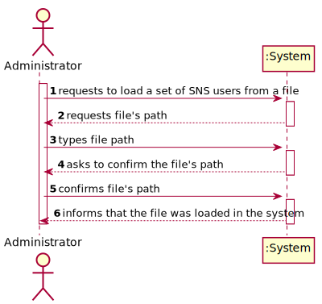
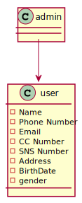
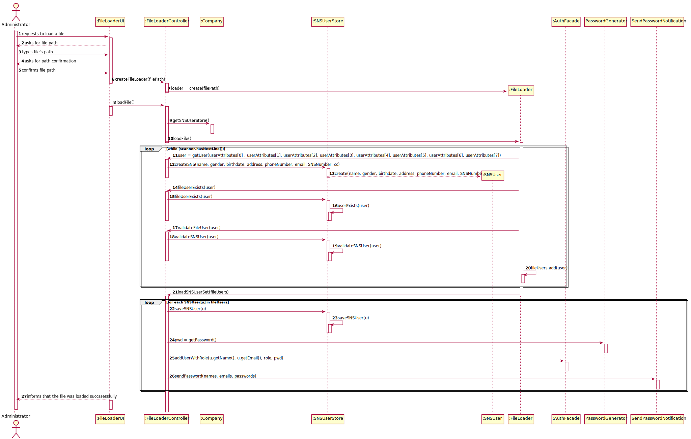
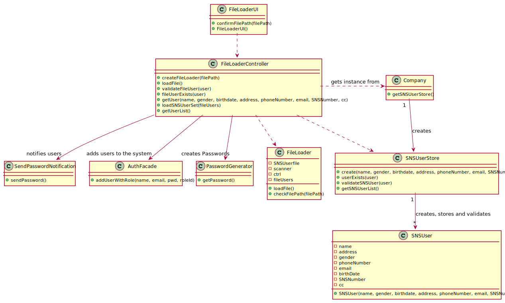

# US 14 - Load a set of users from a CSV file

## 1. Requirements Engineering

### 1.1. User Story Description

*As an administrator, I want to load a set of users from a CSV file*

### 1.2. Customer Specifications and Clarifications 

#### Customer Specifications

**From the Specifications Document:**
- "[...]Any Administrator uses the application to register centers, SNS users, center coordinators, receptionists, and nurses enrolled in the vaccination process."
- "[...]All those who wish to use the application must be authenticated with a password holding seven alphanumeric characters, including three capital letters and two digits"

**From the Client's clarifications:**
- Question : What would be the sequence of paramaters to be read on the CSV?
    - Answer : "Name, Sex, Birth Date, Address, Phone Number, E-mail, SNS User Number and Citizen Card Number."
- Question : When the system is reading the file, should it discard all the lines that contain input mistakes? For example, if there is a line that contains a phone number that has the wrong number of digits, should the system discard the whole line in the moment that this error is noticed?
    - Answer : Answered on other response: "CSV files that have erros should not be loaded."
- Question : Is it possible that the file can contain lines with incomplete information in some fields (e.g. N/A). If so, should we read those lines as well and leave those fields empty or shall we discard that complete line?
    - Answer : "CSV files that have errors should not be loaded. Opcional attributes may have a NA value."
- Question : When the admin wants to upload a CSV file to be read, should the file be stored at a specific location on the computer (e.g. the desktop) or should the admin be able to choose the file he wants to upload in a file explorer?
    - Answer : "The Administrator should write the file path. In Sprint C we do not ask students to develop a graphical user interface."
- Question : What should the system do if the file to be loaded has information that is repeated? For example, if there are 5 lines that have the same information or that have the same attribute, like the phone number, should the whole file be discarded?
    - Answer : 
      "If the file does not have other errors, all records should be used to register users. The business rules will be used to decide if all file records will be used to register a user.
      For instance, if all users in the CSV file are already registered in system, the file should be processed normally but no user will be added to the system (because the users are already in the system)."
- Question : Should our application detect if the CSV file to be loaded contains the header, or should we ask the user if is submitting a file with a header or not?
    - Answer : "The application should automatically detect the CSV file type."
- Question : On the last meeting you said that header contains names of the attributes that are listed in the file. My question is what is the delimiter for the header? Does it have points between words, commas or something else?
    - Answer : Each type of CSV file has only one delimiter character. 

### 1.3. Acceptance Criteria

- **AC1:** *The Administrator must become a system user.*
- **AC2:** *The application must support importing two types of CSV files one has a header and the other doesn't.*
- **AC3:** *The password  should be randomly generated*

### 1.4. Found out Dependencies

*There is a dependecy to US3 (As a receptionist, I want to register a SNS user) because SNSUser registration has to be possible in order to load the set of SNSUsers from a file.*

### 1.5 Input and Output Data

####Input Data

*Typed Data*

- Path of the CSV file

####Output Data

- Confirmation that the file was loaded succssessfully.

### 1.6. System Sequence Diagram (SSD)

*Insert here a SSD depicting the envisioned Actor-System interactions and throughout which data is inputted and outputted to fulfill the requirement. All interactions must be numbered.*

### 1.7 Other Relevant Remarks

*Use this section to capture other relevant information that is related with this US such as (i) special requirements ; (ii) data and/or technology variations; (iii) how often this US is held.* 

## 2. OO Analysis

### 2.1. Relevant Domain Model Excerpt 
*In this section, it is suggested to present an excerpt of the domain model that is seen as relevant to fulfill this requirement.* 

### 2.2. Other Remarks

## 3. Design - User Story Realization

### 3.1. Rationale

| Interaction ID                                              | Question: Which class is responsible for...                      | Answer                                                                                                        | Justification (with patterns)                                                                                    |
|:------------------------------------------------------------|:-----------------------------------------------------------------|:--------------------------------------------------------------------------------------------------------------|:-----------------------------------------------------------------------------------------------------------------|
| Step 1 : requests to load a set of SNS users from a file 		 |                                                                  |                                                                                                               |                                                                                                                  |                             
|                                                             | ...coordinating the US?                                          | FileLoaderController                                                                                          | Controlller                                                                                                      ||
|                                                             | ...interacting with the actor?                                   | FileLoaderUI                                                                                                  | Pure Fabrication: there is no reason to assign this responsibility to any existing class in the Domain Model.    |                                                          |
| Step 2 : requests file's path 		                            | ...interacting with the actor?  							                          | FileLoaderUI                                                                                                  | IE: is responsible for user interactions.                                                                        |
| Step 3 : types file path		                                  | ...saving the file's path?							                                | FileLoader                                                                                                    | IE: a FileLoader knows its own data.                                                                             |
| Step 4 : asks to confirm the file's path		                  | ...interacting with the actor?							                            | FileLoaderUI                                                                                                  | IE: is responsible for user interactions.                                                                        |              
| Step 5 : confirms the file's path		                         | ...reading input?							                                         | FileLoaderUI                                                                                                  | IE: is responsible for user interactions.                                                                        |
|                                                             | ...instanciating a FileLoader                                    | FileLoaderController                                                                                          | Creator   LC & HC: this way it is possible to decrease the responsibilities assigned to the the Company class |
|                                                             | ...loading the file?                                             | FileLoader                                                                                                    | IE: owns the current file.                                                                                       |
|                                                             | ...validanting locally the filePath?                             | FileLoader                                                                                                    | IE: knows its data                                                                                               |
|                                                             | ...validating locally  the file's format?                        | FileLoader                                                                                                    | IE: knows file's data                                                                                            |
|                                                             | ...validating the SNS User attributes in each line from the file | SNSUser                                                                                                       | IE: knows its data                                                                                               |
|                                                             | ...checking if the SNSUser already exists?                       | SNSUserStore                                                                                                  | IE: knows all SNS users                                                                                          |
|                                                             | ...saving the SNS users imported from the file                   | SNSUserStore                                                                                                  | IE: stores all SNS users                                                                                         |
|                                                             | ...saving the SNS users as users in the system                       | UserStore                                                        | IE:stores all users in the system                                                                             |
|                                                             | ...creating the password                                             | PasswordGenerator                                                | Pure Fabrication: there is no reason to assign this responsibility to any existing class in the Domain Model.                                                                                                              |
|                                                             | ...providing a notification informing which are the users passwords? | SendPasswordNotification                                         | Pure Fabrication: there is no reason to assign this responsibility to any existing class in the Domain Model. |
| Step 6 : informs that the file was loaded in the system     | 	...interacting with the actor?						                            | FileLoaderUI                                                                                                  | IE: is responsible for user interactions.                                                                        |

### Systematization ##

According to the taken rationale, the conceptual classes promoted to software classes are: 

 * FileLoader
 * Company
 * SNSUser
 * SNSUserStore

Other software classes (i.e. Pure Fabrication) identified: 
 * FileLoaderUI  
 * FileLoaderController
 * SendPasswordNotification
 * PasswordGenerator

## 3.2. Sequence Diagram (SD)

*In this section, it is suggested to present an UML dynamic view stating the sequence of domain related software objects' interactions that allows to fulfill the requirement.* 

## 3.3. Class Diagram (CD)

*In this section, it is suggested to present an UML static view representing the main domain related software classes that are involved in fulfilling the requirement as well as and their relations, attributes and methods.*

# 4. Tests 

**Type 1 contains a header and item separation is made using: ;**
**Type 2 doesn't contain a header and item separation is made using: ,**

**Test 1:** Check if it is possible to load a valid file

	@Test
    void loadValidFile() {

        FileLoader validFileLoaderType1 = new FileLoader(PATH_TO_VALID_FILE1);
        FileLoader validFileLoaderType2 = new FileLoader(PATH_TO_VALID_FILE2);

        //TYPE1
        //checks if it is possible to load a valid file
        assertTrue(validFileLoaderType1.loadFile(1));

        //TYPE2
        //checks if it is possible to load a valid file
        assertTrue(validFileLoaderType2.loadFile(2));

    }

**Test 2:** Check if it is possible to load an invalid file

    @Test
    void loadInvalidFile() {

        FileLoader invalidFileLoaderType1 = new FileLoader(PATH_TO_INVALID_FILE1);
        FileLoader invalidFileLoaderType2 = new FileLoader(PATH_TO_INVALID_FILE2);

        //TYPE1
        //checks that it is not possible to load an invalid file
        assertFalse(invalidFileLoaderType1.loadFile(1));

        //TYPE 2
        //checks that it is not possible to load an invalid file
        assertFalse(invalidFileLoaderType2.loadFile(2));
    }

**Test 3:** Checks if a valid file path is accepted

    @Test
    void checkFilePath() {
        FileLoader validFileLoaderType1 = new FileLoader(PATH_TO_VALID_FILE1);
        FileLoader validFileLoaderType2 = new FileLoader(PATH_TO_VALID_FILE2);

        //TYPE1
        //checks if a valid path is accepted
        assertTrue(validFileLoaderType2.checkFilePath(PATH_TO_VALID_FILE1));

        //TYPE2
        //checks if a valid path is accepted
        assertTrue(validFileLoaderType2.checkFilePath(PATH_TO_VALID_FILE2));
    }

**Test 4:** Checks if an invalid file path is rejected

    @Test
    void checkFilePath() {

        //checks if an invalid path is rejected
        assertFalse(validFileLoaderType2.checkFilePath(INVALID_PATH));
    }
    

# 5. Construction (Implementation)

# 6. Integration and Demo 

*In this section, it is suggested to describe the efforts made to integrate this functionality with the other features of the system.*

# 7. Observations

*In this section, it is suggested to present a critical perspective on the developed work, pointing, for example, to other alternatives and or future related work.*

