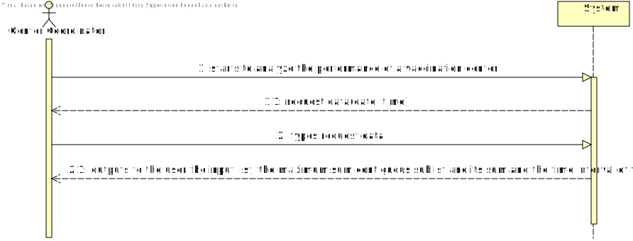
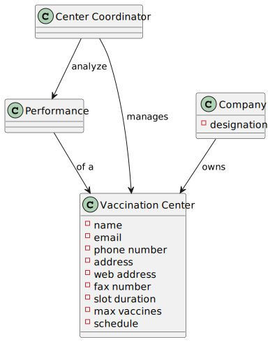
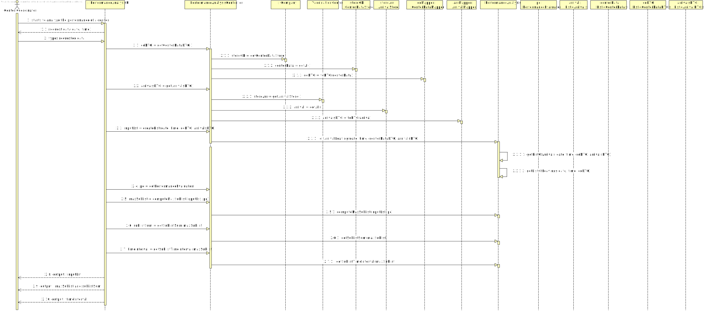
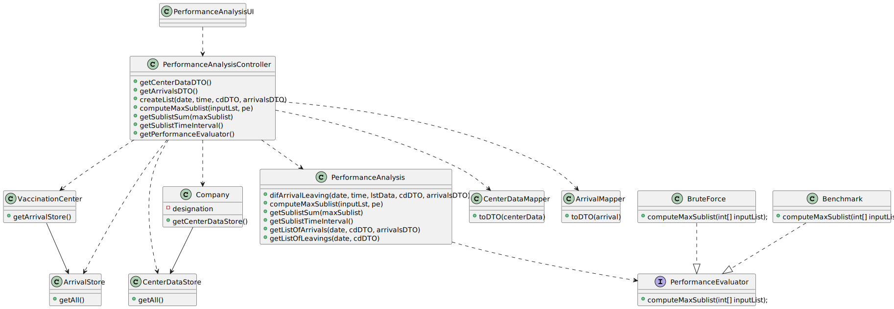

# US 016 - To analyze the performance of a center

## 1. Requirements Engineering

### 1.1. User Story Description

- As a center coordinator, I intend to analyze the performance of a center.

### 1.2. Customer Specifications and Clarifications 

#### From the specifications document:

>- "The goal of the performance
  analysis is to decrease the number of clients in the center, from the moment they register at the
 arrival, until the moment they receive the SMS informing they can leave the vaccination center."

>- "To evaluate this, it proceeds as follows: for any time interval on one day, the difference between the
  number of new clients arrival and the number of clients leaving the center every five-minute period
  is computed."

>- "In the case of a working day, with a center open from 8 a.m. until 8 p.m., a list with
  144 integers is obtained, where a positive integer means that in such a five-minute slot more clients
  arrive at the center for vaccination than clients leave with the vaccination process completed. A
  negative integer means the opposite." 

>- "So, the application should implement a bruteforce
  algorithm (an algorithm which examines all the contiguous subsequences) to determine the
  contiguous subsequence with maximum sum."

>- "The implemented algorithm should be analyzed in terms of its worst-case time complexity, and it should be compared to a benchmark algorithm
  provided."

#### From the client clarifications :

>- **Question:** "In US 16, should the coordinator have the option to choose which algorithm to run (e.g. via a configuration file or while running the application) in order to determine the goal sublist, or is the Benchmark Algorithm strictly for drawing comparisons with the Bruteforce one?"
>- **Answer:** The algorithm to run should be defined in a configuration file.

>- **Question:** "I would like to ask that if to analyse the performance of a center, we can assume (as a pre requirement) that the center coordinator was already attributed to a specific vaccination center and proceed with the US as so (like the center coordinator does not have to choose at a certain point where he is working. This is already treated before this US happens). Could you clarify this?"
>- **Answer:** A center coordinator can only coordinate one vaccination center. The center coordinator can only analyze the performance of the center that he coordinates.

>- **Question:** "I would like to know if we could strict the user to pick only those intervals (m) (i.e. 1, 5, 10, 20, 30) as options for analyzing the performance of a center, since picking intervals is dependent on the list which is 720/m (which the length is an integer result). If we let the user pick an interval that results in a non-integer result, this will result in an invalid list since some data for the performance analysis will be lost. Can you provide a clarification on this situation?"
>- **Answer:** The user can introduce any interval value. The system should validate the interval value introduced by the user.

>- **Question:** "From the Sprint D requirements it is possible to understand that we ought to implement a procedure that creates a list with the differences between the number of new clients arriving and the number of leaving clients for each time interval. My question then is, should this list strictly data from the legacy system (csv file from moodle which is loaded in US17), or should it also include data from our system?"
>- **Answer:** US 16 is for all the data that exists in the system.

### 1.3. Acceptance Criteria

- **AC1:** date format must be "dd/MM/yyyy"
- **AC2:** time interval must be in minutes
- **AC3:** The algorithm to run should be defined in a configuration file(Brute-force or Benchmark).
- **AC4:** The data used is of all system and not just the legacy system data.

### 1.4. Found out Dependencies

- There is a dependency to "US017 : to import data from the legacy system" since the center coordinator needs that data in order to analyze the performance of a center.

### 1.5 Input and Output Data

#### Input Data
- **Typed Data:**
    - Date
    - Time Interval(minutes)

#### Output Data
- Input list
- Maximum sum contiguous sublist and its sum
- Time interval corresponding to the sublist

### 1.6. System Sequence Diagram (SSD)

### 1.7 Other Relevant Remarks

*Use this section to capture other relevant information that is related with this US such as (i) special requirements ; (ii) data and/or technology variations; (iii) how often this US is held.* 

## 2. OO Analysis

### 2.1. Relevant Domain Model Excerpt 

### 2.2. Other Remarks

*Use this section to capture some aditional notes/remarks that must be taken into consideration into the design activity. In some case, it might be usefull to add other analysis artifacts (e.g. activity or state diagrams).* 

## 3. Design - User Story Realization 

### 3.1. Rationale

**The rationale grounds on the SSD interactions and the identified input/output data.**

| Interaction ID | Question: Which class is responsible for...                                          | Answer                        | Justification (with patterns)                                                                                                         |
|:---------------|:-------------------------------------------------------------------------------------|:------------------------------|:--------------------------------------------------------------------------------------------------------------------------------------|
| Step 1  		     | ...interacting with Center Coordinator?						                                        | PerformanceAnalysisUI         | **Pure Fabrication:**  there is no reason to assign this responsibility to any existing class in the Domain Model                     |
| 		             | ...coordinating the US016? 							                                                   | PerformanceAnalysisController | **Controller**                                                                                                                        |
| Step 2  		     | ...getting a list of all the data of class CenterData? 							                       | CenterDataStore               | **IE:** knows all Center data                                                                                                         |
| | ...transferring the data of class CenterData from the domain to the UI?              | CenterDataMapper              | **DTO:** When there is so much data to transfer, it is better to opt by using a DTO in order to reduce coupling between UI and domain |
| | ...knowing the class CenterDataStore?                                                | Company                       | **IE:** Company knows the CenterDataStore to which it is delegating some tasks                                                        |
| | ...getting a list of all the data of class Arrival?                                  | ArrivalStore                  | **IE:** knows all Arrival data                                                                                                        |
| | ...transferring the data of class Arrival from the domain to the UI?                 | ArrivalMapper                 | **DTO:** When there is so much data to transfer, it is better to opt by using a DTO in order to reduce coupling between UI and domain |
| | ...knowing the class ArrivalStore?                                                   | VaccinationCenter             | **IE:** VaccinationCenter knows the ArrivalStore to wich it is delegating some tasks                                                  |
| | ...doing all the calculus required and call the class with the brute-force algorithm | PerformanceAnalysis           | **IE:** class responsible for analyze the performance of a center by doing all calculus required                                      |
| 		             | ...calculating the maximum sum contiguous sublist? 							                           | BruteForce or Benchmark       | **IE:** class responsible for applying the brute-force algorithm                                                                      |
| Step 3  		     | ...output the results to the user? 							                                           | PerformanceAnalysisUI         | **IE:** is responsible for user interactions                                                                                          |

### Systematization ##

According to the taken rationale, the conceptual classes promoted to software classes are: 

 * Company
 * VaccinationCenter
 * PerformanceAnalysis

Other software classes (i.e. Pure Fabrication) identified: 
 * PerformanceAnalysisUI  
 * PerformanceAnalysisController
 * CenterDataStore
 * ArrivalStore
 * CenterDataMapper
 * ArrivalMapper

## 3.2. Sequence Diagram (SD)

## 3.3. Class Diagram (CD)

# 4. Tests

**Data used in the tests:**

        CenterData cd1 = new CenterData("5/30/2022" , ConvertTimeFormat.convert("8:24") , "5/30/2022" ,"8:00", "5/30/2022" ,"9:11"
           , "5/30/2022" , "13:43","161593120","21C16-05",	"Spikevax",	"Primeira");

        CenterData cd2 = new CenterData("5/30/2022" , ConvertTimeFormat.convert("9:24") , "5/30/2022" ,"8:00", "5/30/2022" ,"9:11"
                , "5/30/2022" , "14:43","161593120","21C16-05",	"Spikevax",	"Primeira");

        CenterData cd3 = new CenterData("5/30/2022" , "10:24" , "5/30/2022" ,"8:00", "5/30/2022" ,"9:11"
                , "5/30/2022" , "15:43","161593120","21C16-05",	"Spikevax",	"Primeira");

        CenterData cd4 = new CenterData("5/30/2022" , "11:24" , "5/30/2022" ,"8:00", "5/30/2022" ,"9:11"
                , "5/30/2022" , "16:43","161593120","21C16-05",	"Spikevax",	"Primeira");

        CenterData cd5 = new CenterData("5/30/2022" , "12:24" , "5/30/2022" ,"8:00", "5/30/2022" ,"9:11"
                , "5/30/2022" , "17:43","161593120","21C16-05",	"Spikevax",	"Primeira");

        List<CenterData> lstData = new ArrayList<>();
        lstData.add(cd1);
        lstData.add(cd2);
        lstData.add(cd3);
        lstData.add(cd4);
        lstData.add(cd5);

**Test 1:** Check if the method that will create the input list for the algorithm its running accordingly. 

	@Test
    void difArrivalLeaving() throws ParseException {
        int[] expected = {1,1,1,1,1,-1,-1,-1,-1,-1,0,0};
        int[] inputList = perfAnalysis.difArrivalLeaving("5/30/2022" , 60 , lstData );
        for (Integer i : inputList) {
            System.out.println(i);
        }
        assertArrayEquals(expected,inputList);

    }

**Test 2:** Check if the brute-force algorithm own made and provided its giving the expected results.

    @Test
    void computeMaxSublist() {
        BruteForce tf = new BruteForce();
        Benchmark bm = new Benchmark();
        int[] inputList = new int[]{29, -32, -9, -25, 44, 12, -61, 51, -9, 44, 74, 4};
        int[] maxSubList = perfAnalysis.computeMaxSublist(inputList , tf);
        int[] maxSubList2 = perfAnalyis.computeMaxSubList(inputList, bm);
        int[] expected = {51, -9, 44, 74, 4};
        assertArrayEquals(expected,maxSubList);
        assertArrayEquals(expected,maxSubList2);
    }

**Test 3:** Check if the method that calculates the sum of all elements of the max contiguous sublist its working properly.

    @Test
    void getSublistSum() {
        int[] inputList = new int[]{29, -32, -9, -25, 44, 12, -61, 51, -9, 44, 74, 4};
        int expected = 122;
        int result = perfAnalysis.getSublistSum(inputList);
        assertEquals(expected,result);
    }

**Test 4:** Check if the method that provides the time interval(start and end in the format HH:mm) of the max contiguous sublist its working properly.

    @Test
    void getSublistTimeInterval() {
        BruteForce tf = new BruteForce();
        int[] inputList = perfAnalysis.difArrivalLeaving("5/30/2022" , 60 , lstData );
        int[] maxSub = perfAnalysis.computeMaxSublist(inputList,tf);
        String expected = "[08:00 ; 12:00]";
        String result = perfAnalysis.getSublistTimeInterval(tf);
        assertTrue(checkIfEquals(expected,result));
    }

# 5. Construction (Implementation)

*In this section, it is suggested to provide, if necessary, some evidence that the construction/implementation is in accordance with the previously carried out design. Furthermore, it is recommeded to mention/describe the existence of other relevant (e.g. configuration) files and highlight relevant commits.*

*It is also recommended to organize this content by subsections.* 

# 6. Integration and Demo 

*In this section, it is suggested to describe the efforts made to integrate this functionality with the other features of the system.*

# 7. Observations

*In this section, it is suggested to present a critical perspective on the developed work, pointing, for example, to other alternatives and or future related work.*

