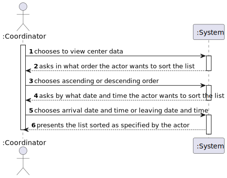

# US 17 - As a center coordinator, I want to import data from a legacy system that was used in the past to manage centers.

## 1. Requirements Engineering

### 1.1. User Story Description

*As a center coordinator, I want to import data from a legacy system that was used in the past to manage centers.The imported data should be presented to the user sorted by arrival time or by the center leaving time.*
*The name of the SNS user and the vaccine type Short Description attribute should also be presented to the user.*

### 1.2. Customer Specifications and Clarifications 

**From the Specifications Document:**

- " Each vaccination center has a Center Coordinator that has the responsibility to manage the Covid19 vaccination process."
- " The Center Coordinator wants to monitor the vaccination process, to see statistics and charts, to evaluate the performance of the vaccination process, generate reports and analyze data from other centers, including data from legacy systems."
- " The computational complexity analysis (of the brute-force algorithm and any sorting
 algorithms implemented within this application), must be accompanied by the observation of the
execution time of the algorithms for inputs of variable size, in order to observe the asymptotic
behavior. "
- " The worst-case time complexity analysis of the algorithms should be properly
  documented in the user manual of the application (in the annexes). The user manual must be
  delivered with the application.
  "

**From the Client's clarifications:**

- Question :  I was analysing the csv file that should be imported for US17 (the one that is in moodle), I noticed that the date attributes are written like this 5/30/2022 I thought that the date format should be DD/MM/YYYY. I also noticed, that the time is written like this, 9:43, I also thought that the time format should be written like this HH:MM, (in this case it would be 09:43). Are the date and time formats diferent for US17?
    - Answer : "That file is from a legacy system, that uses a different date and time format. The date and time should be converted when loading the data into the application that we are developing."

- Question : It should be an option to choose to either sort by arrival time or by the center leaving time?
    - Answer : "The user can choose to sort by arrival time or by the center leaving time."

- Question : In the Sprint D requirements is stated that two sorting algorithms should be implemented and that the imported data should be sorted by arrival time or center leaving time. Should each algorithm be capable of both sortings or is one of the algorithms supposed to do one (e.g. arrival time) and the other the remaining sorting criteria (e.g. leaving time)?
    - Answer : "Each algorithm should be capable of doing both sortings. The application should be prepared to run both algorithms. The algorithm that will be used to sort data should be defined in a configuration file."

- Question : Validation for phoneNumber : should just verify if it has 9 digits? Validation for CCCard: should just verify if it has 8 digits? Validation for SNSUSER: should just verify if it has 9 digits also? For this validations it doens´t matter if it starts with 91,92, for example.
    - Answer : "Yes, you are correct. The goal is only to validate the number of digits in attributes phoneNumber, CCCard and SNSUSER number."

- Question : Considering the Birthdate...Same Birthdate are not valid because is not a leap year, for example, 29/02/1957, 29/02/1961..... should we not do this validation and accept this invalid date? Because the user born in a day that doesn´t exist....
    - Answer : "This is an error and I will update the file. The application must validate the dates. Thank you!"

- Question : in a meeting you already clarified that when uploading a file from a legacy system the application should check if the SNS Users are already registered and if not US 014 should be put to use. My question is now if only one or two SNS Users are not registered, should the whole legacy file be discarded?
    - Answer : "SNS users that are not registered should be loaded/registered. The other SNS users should not be registered again and should be ignored." 

- Question : 

  In the previous clarifications you said that file with user data should be loaded using US014 (register the users). My questions are:

  1 - should this file be loaded automatically before loading the main file from the legacy system with vaccination information?

  2 - Or, should we start loading the main file and, when the program sees the first user that is not registered in the system, the file with user data is loaded using US014? Also, is this process automatic or the coordinator should choose the option or at least confirm the loading?

  3 - Also, should the coordinator indicate the path to both files?

  - Answer: "US14 and US17 are two different and independent features of the system. In US17, if the SNS user does not exist in the system, the vaccination of this SNS user should not be loaded. The system should continue processing the CSV file until all vaccinations are processed."

- Question : Is there any correct format for the lot number? Should we simply assume that the lot number will always appear like this 21C16-05 ,like it's written in the file, and not validate it?
  
  - Answer : "The lot number has five alphanumeric characters an hyphen and two numerical characters (examples: 21C16-05 and A1C16-22 )."

  
- Question :  When sorting data by arrival time or central leaving time, should we sort from greater to smallest or from smallest to greater?

  - Answer : "The user must be able to sort in ascending and descending order."

- Question :  Should the vaccine named Spikevax, (the one in the given CSV file for US17), be registered before loading the CSV file? I'm wondering how would we show the vaccine type short description of this vaccine (Spikevax) without having the vaccine registered.

  - Answer : "Yes."

### 1.3. Acceptance Criteria

- **AC1:** The actor chooses if the application sorts by arrival time or by the center leaving time.
- **AC2:** The application must convert time and date formats from the legacy system's file to the proper formats and validate them.
- **AC3:** Each algorithm should be capable of doing both sortings. The application should be prepared to run both algorithms. The algorithm is chosen manually by the coordinator
- **AC4:** The algorithm that will be used to sort data should be defined in a configuration file.
- **AC5:** US17 must work with registered users, vaccination information regarding unregistered SNS number should not be loaded.
- **AC6:** The coordinator should be able to choose the file that is to be uploaded.
- **AC7:** The coordinator should be able to choose to sort by ascending or descending order.

### 1.4. Found out Dependencies

- There is a dependency to US3 because this US will need to register SNS users.
- There is a dependency to US14 because this US must be used to register the SNS users from US17 (if they haven't already been registered).

### 1.5 Input and Output Data

#### Input Data

*Typed Data*
- The path of the file that will be imported.

*Selected Data*
- Sorting by arrival time or leaving time.
- Algorithm that will be implemented.

#### Output Data

- Imported data sorted as specified by the actor, with the SNS user's name and vaccine type description shown.

### 1.6. System Sequence Diagram (SSD)

#### Load Data SSD

#### View Data SSD

### 1.7 Other Relevant Remarks

*US17 has two main operations which are to import a center's performance data file and to show this data sorted in a list.To simplify the SSD, SD, CD diagrams and the rationale table, I decided to dedicate one diagram/table for each of these tasks.*

## 2. OO Analysis

### 2.1. Relevant Domain Model Excerpt 
*In this section, it is suggested to present an excerpt of the domain model that is seen as relevant to fulfill this requirement.* 

### 2.2. Other Remarks

*Before step 1 of both tables and SSDs the actor chooses in the UI to load data or to view the list.*

*CompareInstance is a class which has,compareDateTime, a comparator dedicated to compare DateTime instances.This class and the comparator appear in the view data SD and table.*

## 3. Design - User Story Realization 

### 3.1. Rationale

#### Load Data Table

| Interaction ID                                           | Question: Which class is responsible for...                                                              | Answer                                                                                                        | Justification (with patterns)                                                                                    |
|:---------------------------------------------------------|:---------------------------------------------------------------------------------------------------------|:--------------------------------------------------------------------------------------------------------------|:-----------------------------------------------------------------------------------------------------------------|
| Step 1 : chooses to load a file 		                       | 	chooses to load a file					                                                                             |                                                                                                               |                                                                                                                  ||
|                                                          | ...coordinating the US?                                                                                  | CenterDataController                                                                                          | Controlller                                                                                                      |
|                                                          | ...interacting with the actor?                                                                           | CenterDataUI                                                                                                  | Pure Fabrication: there is no reason to assign this responsibility to any existing class in the Domain Model.    |                                                          
| Step 2  : asks for file's path		                         | ...interacting with the actor?  							                                                                  | CenterDataUI                                                                                                  | IE: is responsible for user interactions.                                                                        |
| Step 3  : types file's path		                            | ...saving the file's path?							                                                                        | FileLoader                                                                                                    | IE: a FileLoader knows its own data.                                                                             |
| Step 4  : requests for path's confirmation		             | ...interacting with the actor?							                                                                    | CenterDataUI                                                                                                  | IE: is responsible for user interactions.                                                                        |  
| Step 5  : confirms path	                                 | ...reading input?							                                                                                 | FileLoaderUI                                                                                                  | IE: is responsible for user interactions.                                                                        |
|                                                          | ...instanciating a FileLoader?                                                                           | FileLoaderController                                                                                          | Creator   LC & HC: this way it is possible to decrease the responsibilities assigned to the the Company class |
|                                                          | ...loading the file?                                                                                     | FileLoader                                                                                                    | IE: owns the current file.                                                                                       |
|                                                          | ...converting Date and Time to the correct format?                                                       | ConvertTimeFormat & ConvertDateFormat                                                                                               | Pure Fabrication: there is no reason to assign this responsibility to any existing class in the Domain Model. |
|                                                          | ...instanciating a CenterData                            | FileLoader                                                                                               |Creator   LC & HC: this way it is possible to decrease the responsibilities assigned to the the Company class|
|                                                          | ...instanciating a DateTime                              | CenterData                                                                                               |Creator   LC & HC: this way it is possible to decrease the responsibilities assigned to the the Company class|
|                                                          | ...validanting locally the filePath?                                                                     | FileLoader                                                                                                    | IE: knows its data                                                                                               |
|                                                          | ...validating locally  the file's format?                                                                | FileLoader                                                                                                    | IE: knows file's data                                                                                            |
|                                                          | ...validating the CenterData attributes in each line from the file?                                      | CenterData                                                                                                    | IE: knows its data                                                                                               |
|                                                          | ...validating DateTime attributes from CenterData?       | DateTime                                                                                                 |IE: knows its data |
|                                                          | ...checking if the CenterData instance already exists?                                                   | CenterDataStore                                                                                               | IE: knows all CenterData elements                                                                                |
|                                                          | ...checking if SNS number is registered?                                                                 | SNSUserStore                                                                                                                        | IE: knows all SNS users and their SNS numbers                                                                 |
|                                                          | ...saving the CenterData instances imported from the file?                                               | CenterDataStore                                                                                               | IE: stores all CenterData elements                                                                               |
| Step 6  : informs that the file was loaded successfully	 | 							                                                            	...interacting with the actor?						 | CenterDataUI                                                                                                  | IE: is responsible for user interactions.                                                                        |

#### View Data Table

| Interaction ID                                                          | Question: Which class is responsible for...                      | Answer                       | Justification (with patterns)                                                                                 |
|:------------------------------------------------------------------------|:-----------------------------------------------------------------|:-----------------------------|:--------------------------------------------------------------------------------------------------------------|
| Step 1 : chooses to view center data 		                                 | 							                                                          |                              |                                                                                                               |
|                                                                         | ...coordinating the US?                                          | CenterDataController         | Controlller                                                                                                   |
|                                                                         | ...interacting with the actor?                                   | CenterDataUI                 | Pure Fabrication: there is no reason to assign this responsibility to any existing class in the Domain Model. |  
|                                                                         | ...checking if the list is empty?                                | CenterDataStore              | IE: IE: knows all CenterData elements                                                                         |
| Step 2 : asks in what order the actor wants to sort the list 		         | ...interacting with the actor?  							                          | CenterDataUI                 | IE: is responsible for user interactions.                                                                     |
| Step 3 : chooses ascending or descending order 		                       | 							                                                          |                              |                                                                                                               |
|                                                                         | ...saving order                                                  | SelectionSort or PancakeSort | IE: knows its own data                                                                                        |
| Step 4 : asks by what date and time the actor wants to sort the list 		 | ...interacting with the actor?  							                          | CenterDataUI                 | IE: is responsible for user interactions.                                                                     |
| Step 5 : chooses arrival date and time or leaving date and time 		      | 							                                                          |                              |                                                                                                               |
|                                                                         | ...saving sorting type?                                          | SelectionSort or PancakeSort | IE: knows its own data                                                                                        |
|                                                                         | ...storing CenterData elements?                                  | CenterDataStore              | IE: stores all CenterData elements                                                                            |
|                                                                         | ...storing vaccine type short description of the vaccine related to the CenterData instance? | VaccineStore                                                     | IE: knows all vaccines       |
|                                                                         | ...storing SNS users names related to the CenterData instance?                               | SNSUserStore                                                     | IE: knows all SNS users      |
|                                                                         | ...mapping the CenterData list to CenterDataDTO?                 | CenterDataMapper             | Pure Fabrication: there is no reason to assign this responsibility to any existing class in the Domain Model. |
|                                                                         | ...determining the algorithm that will be used to sort the list? | PropertiesCache              | IE: knows the configuration file's data                                                                       |
|                                                                         | ...sorting the list?                                             | SelectionSort or PancakeSort |Pure Fabrication: there is no reason to assign this responsibility to any existing class in the Domain Model.|
|                                                                         | ...comparing DateTimeInstances                                   | CompareInstance              |Pure Fabrication: there is no reason to assign this responsibility to any existing class in the Domain Model.|
| Step 6 : presents the list sorted as specified by the actor 		          | ...interacting with the actor?  							                          | CenterDataUI                 | IE: is responsible for user interactions.                                                                     |

### Systematization ##

According to the taken rationale, the conceptual classes promoted to software classes are: 

 * FileLoader
 * Company
 * CenterData
 * CenterDataStore
 * SNSUserStore
 * DateTime
 * PropertiesCache
 * VaccineStore
 

Other software classes (i.e. Pure Fabrication) identified: 
 * CenterDataUI  
 * CenterDataController
 * FileLoaderController
 * ConvertTimeFormat
 * ConvertDateFormat
 * CenterDataMapper
 * CompareInstance
 * SelectionSort
 * PancakeSort

## 3.2. Sequence Diagram (SD)

#### Load Data SD

#### View Data SD

## 3.3. Class Diagram (CD)

#### Load Data CD

#### View Data CD

# 4. Tests 
*In this section, it is suggested to systematize how the tests were designed to allow a correct measurement of requirements fulfilling.* 

**_DO NOT COPY ALL DEVELOPED TESTS HERE_**

**Test 1:** Check that dates are converted correctly 

	@Test
    void convert() {
        //Checks if it is converted correctly
        String testConvert = ConvertDateFormat.convert("5/30/2022");
        String expected = "30/05/2022";
        Assertions.assertEquals(expected, testConvert);

        //Checks if method does not convert date strings that are written in the wrong format
        String testDontConvert = ConvertDateFormat.convert("5|30|2022");;
        Assertions.assertNull(testDontConvert);
    }

**Test 2:** Check that times are converted correctly
        
    @Test
    void convert() {
    //Checks if it is converted correctly
    String testConvert = ConvertTimeFormat.convert("9:12");
    String expected = "09:12";
    Assertions.assertEquals(expected, testConvert);

    //Checks if method does not convert time strings that are written in thw wrong format
    String testDontConvert = ConvertTimeFormat.convert("9|12");;
    Assertions.assertNull(testDontConvert);
    }

**Test 3:** Checks if selection sort algorithm is functioning correctly

    @Test
    void sort() {

        // Arrival: 10/05/2020 10:05 Leaving Time: 12/05/2020 12:05
        CenterData cd1 = new CenterData("10/05/2020", "10:05", "10/05/2020", "10:05", "10/05/2020", "10:05",
                "12/05/2020", "12:05", "123456781", "21C16-05", "Spikevax", "first");
        // Arrival: 10/05/2020 12:00 Leaving Time: 12/05/2020 13:05
        CenterData cd2 = new CenterData("10/05/2020", "12:00", "10/05/2020", "12:00", "10/05/2020", "12:00",
                "12/05/2020", "13:05", "123456782", "21C16-05", "Spikevax", "first");
        // Arrival: 11/05/2020 11:05 Leaving Time: 13/05/2020 11:05
        CenterData cd3 = new CenterData("11/05/2020", "11:05", "11/05/2020", "11:05", "11/05/2020", "11:05",
                "13/05/2020", "11:05", "123456783", "21C16-05", "Spikevax", "first");

        ArrayList<CenterData> testArrivalSort = new ArrayList<>();
        testArrivalSort.add(cd2);
        testArrivalSort.add(cd1);
        testArrivalSort.add(cd3);
        //Sorting by ascending arrival time using selection Sort algorithm
        SelectionSort.sort(testArrivalSort, true, true);

        assertEquals("10:05",testArrivalSort.get(0).getArr().getTime());
        assertEquals("12:00",testArrivalSort.get(1).getArr().getTime());
        assertEquals("11:05",testArrivalSort.get(2).getArr().getTime());

        //Sorting by descending arrival time using selection Sort algorithm
        SelectionSort.sort(testArrivalSort, true, false);

        assertEquals("10:05",testArrivalSort.get(2).getArr().getTime());
        assertEquals("12:00",testArrivalSort.get(1).getArr().getTime());
        assertEquals("11:05",testArrivalSort.get(0).getArr().getTime());

        ArrayList<CenterData> testLeaveSort = new ArrayList<>();
        testLeaveSort.add(cd2);
        testLeaveSort.add(cd1);
        testLeaveSort.add(cd3);

        //Sorting by ascending leaving time using selection Sort algorithm
        SelectionSort.sort(testLeaveSort, false, true);
        assertEquals("12:05",testLeaveSort.get(0).getLeave().getTime());
        assertEquals("13:05",testLeaveSort.get(1).getLeave().getTime());
        assertEquals("11:05",testLeaveSort.get(2).getLeave().getTime());

        //Sorting by descending leaving time using selection Sort algorithm
        SelectionSort.sort(testLeaveSort, false, false);
        assertEquals("12:05",testLeaveSort.get(2).getLeave().getTime());
        assertEquals("13:05",testLeaveSort.get(1).getLeave().getTime());
        assertEquals("11:05",testLeaveSort.get(0).getLeave().getTime());
    }

**Test 4:** Checks if pancake sort algorithm is functioning correctly

    @Test
    void sort() {
        // Arrival: 10/05/2020 10:05 Leaving Time: 12/05/2020 12:05
        CenterData cd1 = new CenterData("10/05/2020", "10:05", "10/05/2020", "10:05", "10/05/2020", "10:05",
                "12/05/2020", "12:05", "123456781", "21C16-05", "Spikevax", "first");
        // Arrival: 10/05/2020 12:00 Leaving Time: 12/05/2020 13:05
        CenterData cd2 = new CenterData("10/05/2020", "12:00", "10/05/2020", "12:00", "10/05/2020", "12:00",
                "12/05/2020", "13:05", "123456782", "21C16-05", "Spikevax", "first");
        // Arrival: 11/05/2020 11:05 Leaving Time: 13/05/2020 11:05
        CenterData cd3 = new CenterData("11/05/2020", "11:05", "11/05/2020", "11:05", "11/05/2020", "11:05",
                "13/05/2020", "11:05", "123456783", "21C16-05", "Spikevax", "first");

        ArrayList<CenterData> testArrivalSort = new ArrayList<>();
        testArrivalSort.add(cd2);
        testArrivalSort.add(cd1);
        testArrivalSort.add(cd3);

        //Sorting by ascending arrival time using Pancake Sort algorithm
        PancakeSort.sort(testArrivalSort, true, true);

        assertEquals("10:05",testArrivalSort.get(0).getArr().getTime());
        assertEquals("12:00",testArrivalSort.get(1).getArr().getTime());
        assertEquals("11:05",testArrivalSort.get(2).getArr().getTime());

        //Sorting by descending arrival time using Pancake Sort algorithm
        PancakeSort.sort(testArrivalSort, true, false);

        assertEquals("10:05",testArrivalSort.get(2).getArr().getTime());
        assertEquals("12:00",testArrivalSort.get(1).getArr().getTime());
        assertEquals("11:05",testArrivalSort.get(0).getArr().getTime());

        ArrayList<CenterData> testLeaveSort = new ArrayList<>();
        testLeaveSort.add(cd2);
        testLeaveSort.add(cd1);
        testLeaveSort.add(cd3);

        //Sorting by ascending leaving time using Pancake Sort algorithm
        PancakeSort.sort(testLeaveSort, false, true);

        assertEquals("12:05",testLeaveSort.get(0).getLeave().getTime());
        assertEquals("13:05",testLeaveSort.get(1).getLeave().getTime());
        assertEquals("11:05",testLeaveSort.get(2).getLeave().getTime());

        //Sorting by descending leaving time using Pancake Sort algorithm
        PancakeSort.sort(testLeaveSort, false, false);

        assertEquals("12:05",testLeaveSort.get(2).getLeave().getTime());
        assertEquals("13:05",testLeaveSort.get(1).getLeave().getTime());
        assertEquals("11:05",testLeaveSort.get(0).getLeave().getTime());
    }

**Test 5:** Checks if CenterData validation is functioning correctly

    @Test
    void validateCenterData() {
        CenterData cdValid = new CenterData("10/05/2020", "10:05","10/05/2020", "10:05","10/05/2020", "10:05",
                "10/05/2020", "10:05","123456789", "21C16-05", "Spikevax", "first");
        Assertions.assertTrue(cdValid.validateCenterData());

        CenterData cdInvalid = new CenterData("100/5/2020", "10:05","10/05/2020", "10:05","100/5/2020", "10:05",
                "10/05/2020", "10:05","1234567", "21C16-05", "Spikevax", "first");
        Assertions.assertFalse(cdInvalid.validateCenterData());
    }

**Test 6:** Checks if CenterDataStore is able to detect a CenterData instance that was already added to the store

    @Test
    void centerDataExists() {
        storeTest = new CenterDataStore();
        CenterData cd1 = new CenterData("10/05/2020", "10:05","10/05/2020", "10:05","10/05/2020", "10:05",
                "10/05/2020", "10:05","123456789", "21C16-05", "Spikevax", "first");
        CenterData cd2 = new CenterData("10/05/2020", "10:05","10/05/2020", "10:05","10/05/2020", "10:05",
                "10/05/2020", "10:05","123456789", "21C16-05", "Spikevax", "first");
        CenterData cd3 = new CenterData("10/05/2020", "10:05","10/05/2020", "10:05","10/05/2020", "10:05",
                "10/05/2020", "10:05","123456788", "21C16-05", "Spikevax", "first");

        storeTest.add(cd1);
        Assertions.assertTrue(storeTest.CenterDataExists(cd2));
        Assertions.assertFalse(storeTest.CenterDataExists(cd3));
    }

# 5. Construction (Implementation)

*In this section, it is suggested to provide, if necessary, some evidence that the construction/implementation is in accordance with the previously carried out design. Furthermore, it is recommeded to mention/describe the existence of other relevant (e.g. configuration) files and highlight relevant commits.*

*It is also recommended to organize this content by subsections.* 

# 6. Integration and Demo 

*In this section, it is suggested to describe the efforts made to integrate this functionality with the other features of the system.*

# 7. Observations

*In this section, it is suggested to present a critical perspective on the developed work, pointing, for example, to other alternatives and or future related work.*

